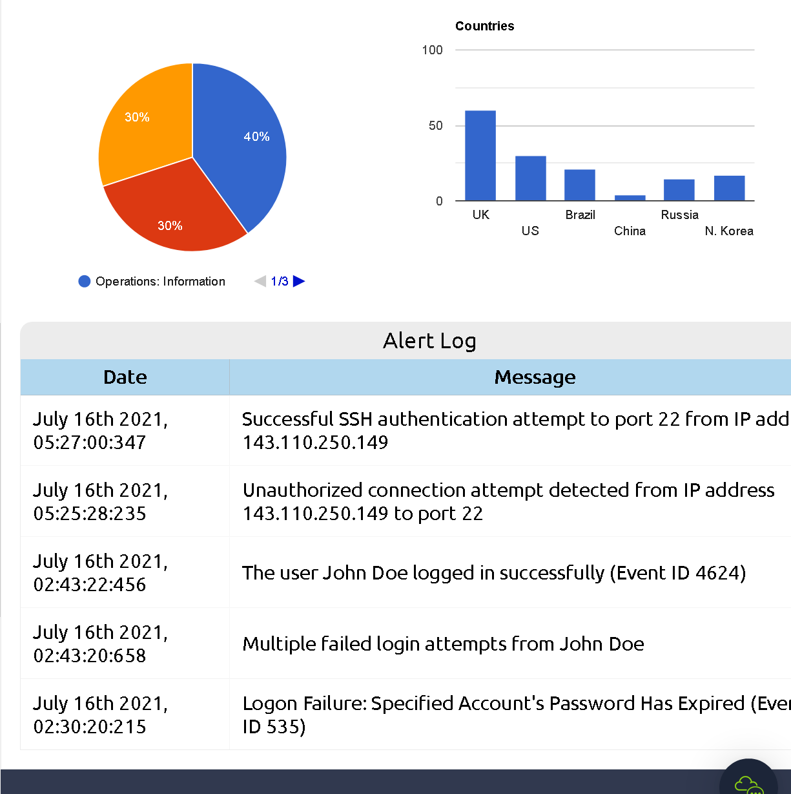
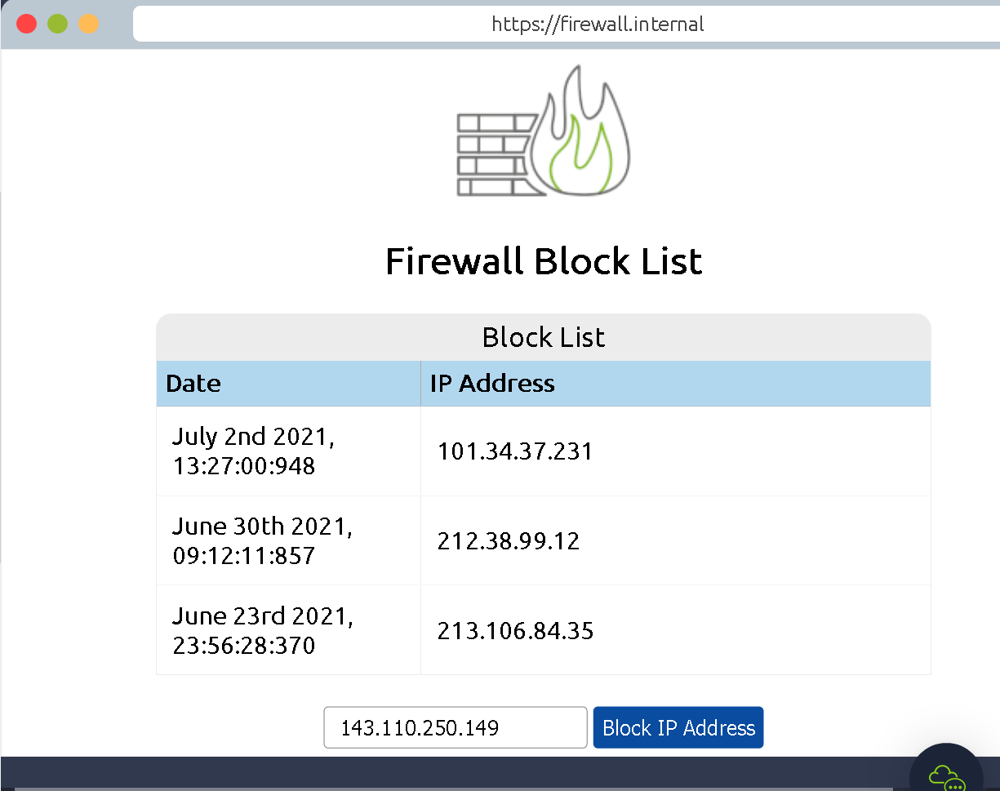

### Introducing defensive security and related topics, such as threat intelligence, SOC, DFIR, and SIEM.

# Task 1 Introduction to Defensive Security

Defensive Security handles two things
1.  Preventing intrusions from occurring
2.  Detecting intrusions when they occur and responding properly

### Question 1: Which team focuses on defensive security?

	Blue team

# Task 2 Areas of Defensive Security

### Security Operations Center (SOC)

- Discover vulnerabilities and fix them
- Handle policy violations
- Handle unauthorized activity
- Handle Network intrusions

#### Threat Intelligence

They gather information about actual and potential enemies.
Gather and analyze data to form conclusions about threats and attackers aswell as their motives

### Digital Forensics

They analzye evidence of an attack and its perpetrators

Analyze
- File system
- System memory
- System logs
- Network logs

#### Incident Response

They are the firefighters.
If a data breach or cyber attack happens they will be there to make sure to handle the situation and prevent more harm from reaching the company aswell as defeat the threat.

#### Malware Analysis

Analyze different kinds of malicious software like:
- Viruses
- Trojan Horses
- Ransomware

They want to learn more abbout these programs and what their intents are

### Question 1: What would you call a team of cyber security professionals that monitors a network and its systems for malicious events?

	Security Operations Center

### Question 2: What does DFIR stand for?

	Digital Forensics Incident Response

### Question 3:  Which kind of malware requires the user to pay money to regain access to their files?

	Ransomware

# Task 3: Practical Example of Defensive Security

First we interact with our SIEM

We then spot that there has been an unauthorized connection attempt detected from the ip
	143.110.250.149
which we then investigate

We then see that the IP address belongs to someone who has some malicious intent. We immediately report this to our SOC team lead.

We got the permission now to block the IP address on our firewall from the team lead and we proceed to do so.

### Question 1 What is the flag that you obtained by following along?:

	THM{THREAT-BLOCKED}

