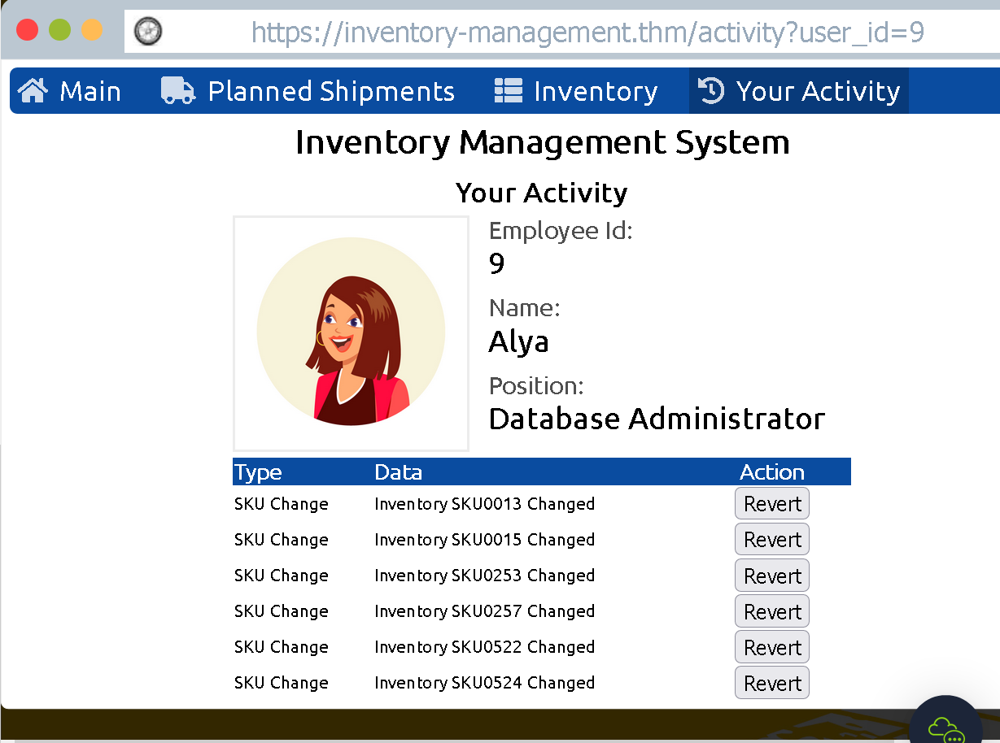

### Learn about web applications and explore some of their common security issues.

## Task 1 Introduction

- What do you need to access a web application?
	Browser

## Task 2 Web Application Security Risks

- You discovered that the login page allows an unlimited number of login attempts without trying to slow down the user or lock the account. What is the category of this security risk?

	Identification and Authentication Failure

- You noticed that the username and password are sent in cleartext without encryption. What is the category of this security risk?

	Cryptographic Failures

## Task 3 Practical Example of Web Application Security

Our system has been hacked and shipments have been randommized. In order to prevent the incorrect shipments to be shipped we will hack the system back to its original state

We know that the attacker has used one of the eployees accounts to mix up the shipments

We can change the id=11 to another number to check other employees activities

We have found the account and we can successfully revert the shipments.

- Check the other users to discover which user account was used to make the malicious changes and revert them. After reverting the changes, what is the flag that you have received?
	#### THM{IDOR_EXPLORED}

