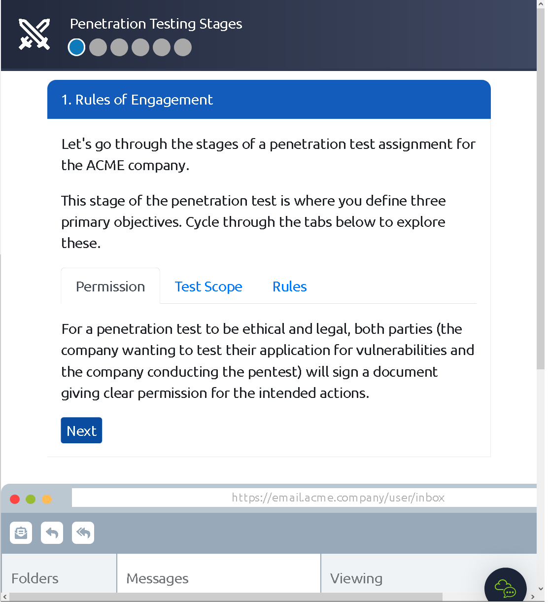
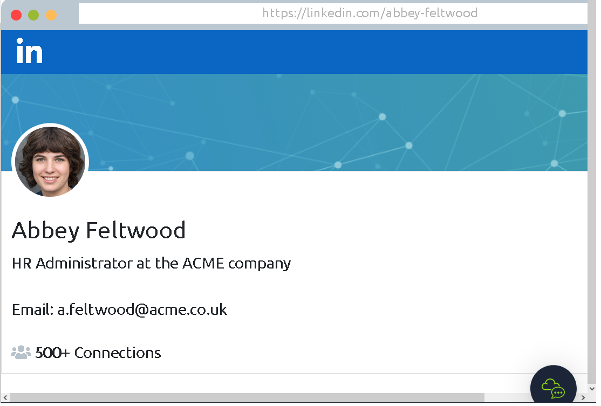

### Learn the important ethics and methodologies behind every pentest.

## Task 1 What is Penetration Testing?

- Read me!
> No answer needed

## Task 2 Penetration Testing Ethics

- You are given permission to perform a security audit on an organisation; what type of hacker would you be?
> White Hat

- You attack an organisation and steal their data, what type of hacker would you be?
> Black Hat

- What document defines how a penetration testing engagement should be carried out?
> Rules of Engagement

## Task 3 Penetration Testing Methodologies

- What stage of penetration testing involves using publicly available information?
> Information Gathering

- If you wanted to use a framework for pentesting telecommunications, what framework would you use? Note: We're looking for the acronym here and not the full name.
> OSSTMM

- What framework focuses on the testing of web applications?
> OWASP

## Task 4 Black box, White box, Grey box Penetration Testing

- You are asked to test an application but are not given access to its source code - what testing process is this?
> Black Box

- You are asked to test a website, and you are given access to the source code - what testing process is this?
> White Box

## Task 5 Practical: ACME Penetration Test

- Complete the penetration test engagement against ACME's infrastructure.

We first gather information about the target with the help of the interent.

We then have found out the IP address of the web server and we use that to perform a scan.

We then exploit vulnerabilities in the system.

Afterwards we try to escalate our privileges to a higher user.

At the end we give a report to the client. Explaining the results of the pentest.

> **THM{PENTEST_COMPLETE}**