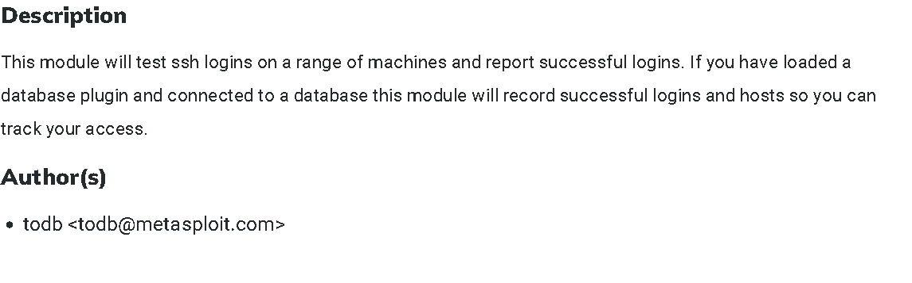

### An introduction to the main components of the Metasploit Framework.

## Task 1 Introduction to Metasploit

The Metasploit Framework is a set of tools that allow information gathering, scanning, exploitation, exploit development, post-exploitation, and more. While the primary usage of the Metasploit Framework focuses on the penetration testing domain, it is also useful for vulnerability research and exploit development.

Type "msfconsole" to start the metasploit command-line interface.

- No answer needed
> No answer needed

## Task 2 Main Components of Metasploit

**Exploit:** A piece of code that uses a vulnerability present on the target system.

**Vulnerability:** A design, coding, or logic flaw affecting the target system. The exploitation of a vulnerability can result in disclosing confidential information or allowing the attacker to execute code on the target system.

**Payload:** An exploit will take advantage of a vulnerability. However, if we want the exploit to have the result we want (gaining access to the target system, read confidential information, etc.), we need to use a payload. Payloads are the code that will run on the target system.

Auxiliary
Any supporting module, such as scanners, crawlers and fuzzers, can be found here.

Encoders
Encode the exploit and payload in the hope that a signature-based antivirus solution may miss them.

Evasion
Will try to evade things like windows defender.

Exploits
Just like the name says they are exploits.

NOPs
No OPeration
They do nothing. They are often used as a buffer to achieve consistent payload sizes.

Payloads
Codes that will run on the target system.

Post
For the post-exploitation part.

- What is the name of the code taking advantage of a flaw on the target system?
> Exploit

- What is the name of the code that runs on the target system to achieve the attacker's goal?
> Payload

- What are self-contained payloads called?
> Singles

- Is "windows/x64/pingback_reverse_tcp" among singles or staged payload?
> Singles

## Task 3 Msfconsole

- How would you search for a module related to Apache?
> Search Apache

- Who provided the auxiliary/scanner/ssh/ssh_login module?

> todb

## Task 4 Working with modules

- How would you set the LPORT value to 6666?
> set LPORT 6666

- How would you set the global value for RHOSTS  to 10.10.19.23 ?
> setg RHOSTS 10.10.19.23

- What command would you use to clear a set payload?
> unset payload

- What command do you use to proceed with the exploitation phase?
> exploit

## Task 5 Summary

- No answer needed.
> No answer needed

