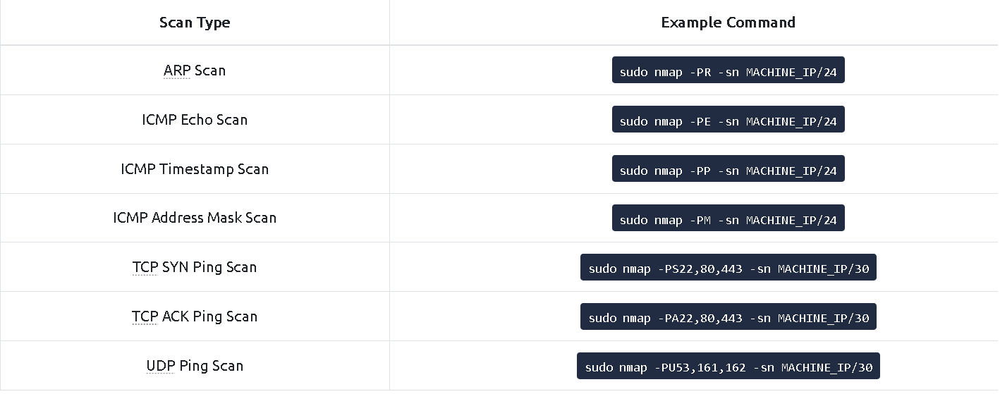

### Learn how to use Nmap to discover live hosts using ARP scan, ICMP scan, and TCP/UDP ping scan.

## Task 1 Introduction

- Some of these questions will require the use of a static site to answer the task questions, while others require the use of the AttackBox and the target VM.
> No answer needed

## Task 2 Subnetworks

- How many devices can see the ARP Request?
> 4

- Did computer6 receive the ARP Request? (Y/N)
> N

- How many devices can see the ARP Request?
> 4

- Did computer6 reply to the ARP Request? (Y/N)
> Y

## Task 3 Enumerating Targets

- What is the first IP address Nmap would scan if you provided `10.10.12.13/29` as your target?
> 10.10.12.8

- How many IP addresses will Nmap scan if you provide the following range `10.10.0-255.101-125`?
> 6400

## Task 4 Discovering Live Hosts

- What is the type of packet that computer1 sent before the ping?
> ARP request

- What is the type of packet that computer1 received before being able to send the ping?
> ARP response

- How many computers responded to the ping request?
> 1

- What is the name of the first device that responded to the first ARP Request?
> router

- What is the name of the first device that responded to the second ARP Request?
> computer5

- Send another Ping Request. Did it require new ARP Requests? (Y/N)
> N

## Task 5 Nmap Host Discovery Using ARP

- How many devices are you able to discover using ARP requests?
> 3

## Task 6 Nmap Host Discovery Using ICMP

- What is the option required to tell Nmap to use ICMP Timestamp to discover live hosts?
> -PP

- What is the option required to tell Nmap to use ICMP Address Mask to discover live hosts?
> -PM

- What is the option required to tell Nmap to use ICMP Echo to discover life hosts?
> -PE

## Task 7 Nmap Host Discovery Using TCP and UDP

- Which TCP ping scan does not require a privileged account?
> TCP SYN Ping

- Which TCP ping scan requires a privileged account?
> TCP SYN Ping

- What option do you need to add to Nmap to run a TCP SYN ping scan on the telnet port?
> -PS23

## Task 8 Using Reverse-DNS Lookup

- We want Nmap to issue a reverse DNS lookup for all the possibles hosts on a subnet, hoping to get some insights from the names. What option should we add?
> -R

## Task 9 Summary

- Ensure you have taken note of all the Nmap options explained in this room. To continue learning about Nmap, please join the room [Nmap Basic Port Scans](https://tryhackme.com/room/nmap02), which introduces the basic types of port scans.
> No answer needed

