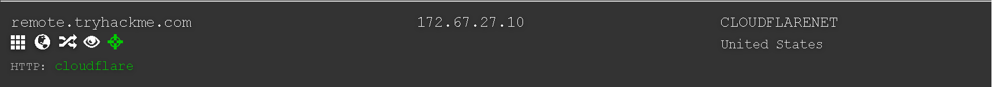
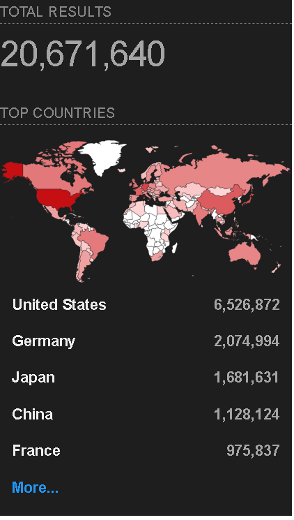
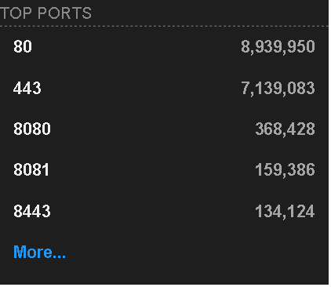
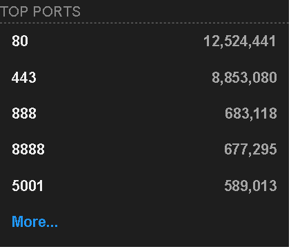

### Learn about the essential tools for passive reconnaissance, such as whois, nslookup, and dig.

## Task 1 Introduction

- This room does not use a target virtual machine (VM) to demonstrate the discussed topics. Instead, we will query public WHOIS servers and DNS servers for domains owned by TryHackMe. Start the AttackBox and make sure it is ready. You will use the AttackBox to answer the questions in later tasks, especially tasks 3 and 4.
> No answer needed

## Task 2 Passive Versus Active Recon

- You visit the Facebook page of the target company, hoping to get some of their employee names. What kind of reconnaissance activity is this? (A for active, P for passive)
> P

- You ping the IP address of the company webserver to check if ICMP traffic is blocked. What kind of reconnaissance activity is this? (A for active, P for passive)
> A

- You happen to meet the IT administrator of the target company at a party. You try to use social engineering to get more information about their systems and network infrastructure. What kind of reconnaissance activity is this? (A for active, P for passive)
> A

## Task 3 Whois

- When was TryHackMe.com registered?
> 20180705

- What is the registrar of TryHackMe.com?

> namecheap.com

- Which company is TryHackMe.com using for name servers?
> Cloudflare.com

## Task 4 nslookup and dig

- Check the TXT records of thmlabs.com. What is the flag there?
> THM{a5b83929888ed36acb0272971e438d78}

## Task 5 DNSDumpster

- Lookup tryhackme.com on DNSDumpster. What is one interesting subdomain that you would discover in addition to www and blog?

> remote

## Task 6 Shodan.io

- According to Shodan.io, what is the 2nd country in the world in terms of the number of publicly accessible Apache servers?

> Germany

- Based on Shodan.io, what is the 3rd most common port used for Apache?

> 8080

- Based on Shodan.io, what is the 3rd most common port used for nginx?

> 888

## Task 7 Summary

- Make sure you note all the points discussed in this room, especially the syntax for the command-line tools.
> No answer needed

