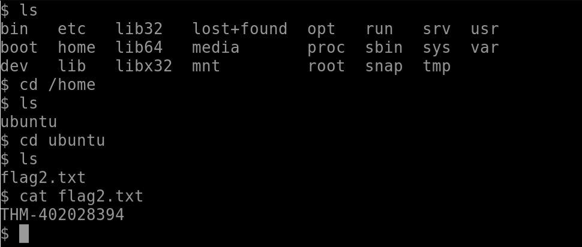

### Learn the fundamentals of Linux privilege escalation. From enumeration to exploitation, get hands-on with over 8 different privilege escalation techniques.

## Task 1 Introduction

- Read the above.
> No answer needed

## Task 2 What is Privilege Escalation?

Privilege Escalation means going from a lower permission account to a higher permission one.

- Read the above.
> No answer needed

## Task 3 Enumeration

- What is the hostname of the target system?

> wade7363

- What is the Linux kernel version of the target system?

> 3.13.0-24-generic

- What Linux is this?

> Ubuntu 14.04 LTS

- What version of the Python language is installed on the system?

> 2.7.6

- What vulnerability seem to affect the kernel of the target system? (Enter a CVE number)

> CVE-2015-1328 

## Task 4 Automated Enumeration Tools

- Install and try a few automated enumeration tools on your local Linux distribution
> No answer needed

## Task 5 Privilege Escalation: Kernel Exploits

- find and use the appropriate kernel exploit to gain root privileges on the target system.
> No answer needed

- What is the content of the flag1.txt file?
> THM-28392872729920

## Task 6 Privilege Escalation: Sudo

- How many programs can the user "karen" run on the target system with sudo rights?

> 3

- What is the content of the flag2.txt file?

We first ls and see which folders we got. We go directly into our home folder and then cd into the  ubuntu folder to find the "flag2.txt" file. We "cat" the file and gain the flag.
> THM-402028394

- How would you use Nmap to spawn a root shell if your user had sudo rights on nmap?

> sudo nmap --interactive

- What is the hash of frank's password?
> $6$2.sUUDsOLIpXKxcr$eImtgFExyr2ls4jsghdD3DHLHHP9X50Iv.jNmwo/BJpphrPRJWjelWEz2HH.joV14aDEwW1c3CahzB1uaqeLR1

## Task 7 Privilege Escalation: SUID

- Which user shares the name of a great comic book writer?

We can cat the "/etc/passwd" file.

> gerryconway

- What is the password of user2?

From the previous task we now know the credentials of user2.

