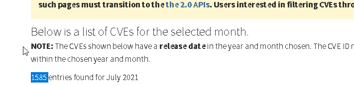
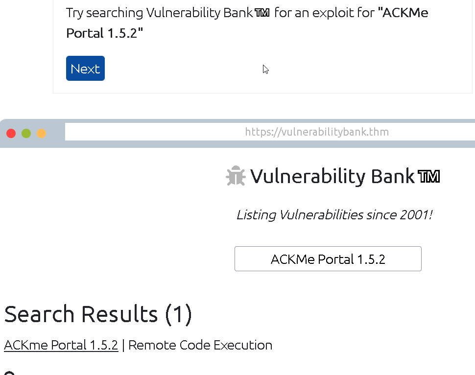
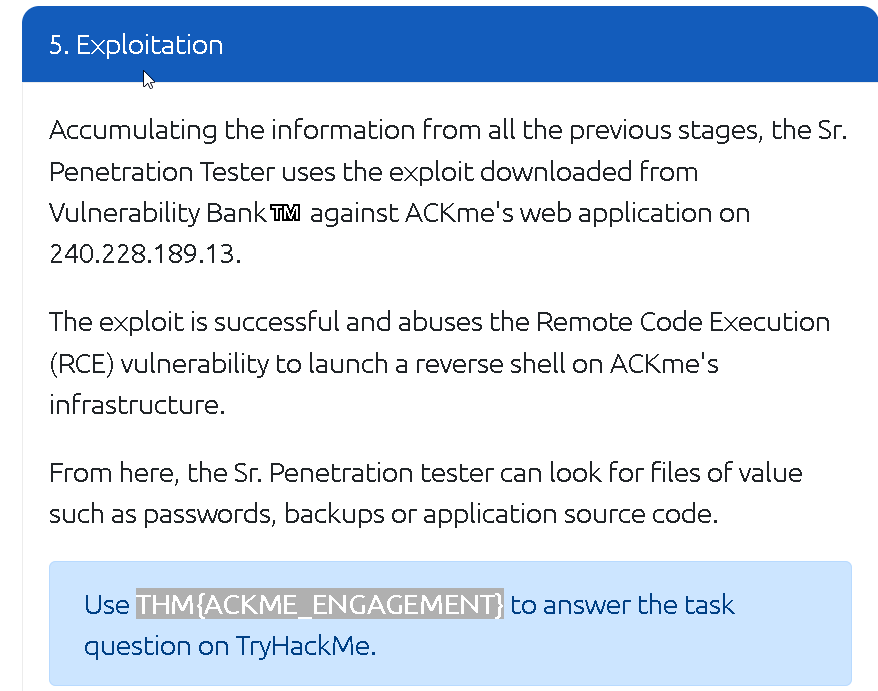

### Understand the flaws of an application and apply your researching skills on some vulnerability databases.

## Task 1 Introduction

- Read this task!
> No answer needed

## Task 2 Introduction to Vulnerabilities

A vulnerability in cybersecurity is defined as a weakness or flaw in the design, implementation or behaviours of a system or application.

-  An attacker has been able to upgrade the permissions of their system account from "user" to "administrator". What type of vulnerability is this?
> Operating System

- You manage to bypass a login panel using cookies to authenticate. What type of vulnerability is this?
> Application Logic

## Task 3 Scoring Vulnerabilities (CVSS & VPR)

A rating on how critical a vulnerability is.

- What year was the first iteration of CVSS published?
> 2005

- If you wanted to assess vulnerability based on the risk it poses to an organisation, what framework would you use? **Note:** We are looking for the acronym here.
> VPR

- If you wanted to use a framework that was free and open-source, what framework would that be? Note: We are looking for the acronym here.
> CVSS

## Task 4 Vulnerability Databases

- Using [NVD](https://nvd.nist.gov/vuln/full-listing), how many CVEs were submitted in July 2021?

> 1585

- Who is the author of [Exploit-DB](https://www.exploit-db.com/)?
> Offensive Security

## Task 5 An Example of Finding a Vulnerability

- What type of vulnerability did we use to find the name and version of the application in this example?
> Version Disclosure

## Task 6 Showcase: Exploiting Ackme's Application

- Follow along with the showcase of exploiting ACKme's application to the end to retrieve a flag. What is this flag?

> **THM{ACKME_ENGAGEMENT}**

## Task 7 Conclusion

- Continue on your learning with the additional rooms in this [module](https://tryhackme.com/module/vulnerability-research).
> No answer needed

