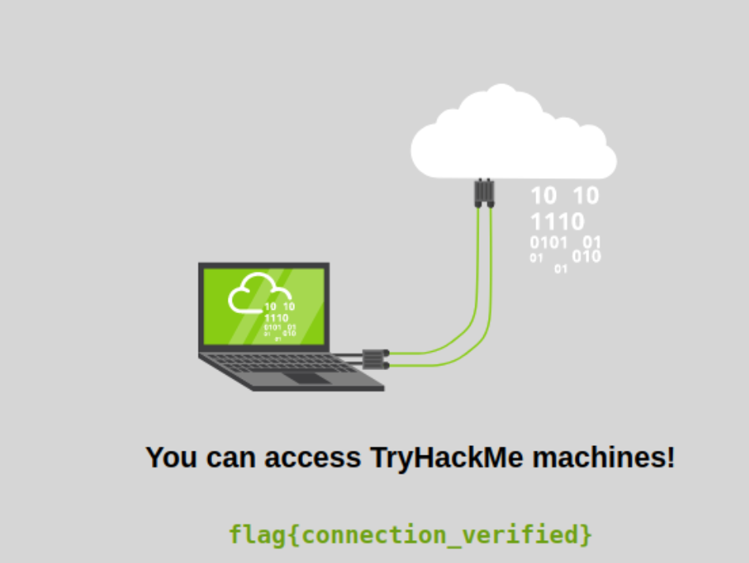

### Learn how to use a TryHackMe room to start your upskilling in cyber security.

## Task 1 Starting your first machine

- Follow the steps in this task. What is the flag text shown on the website of the machine you started on this task?  

>  flag{connection_verified} 