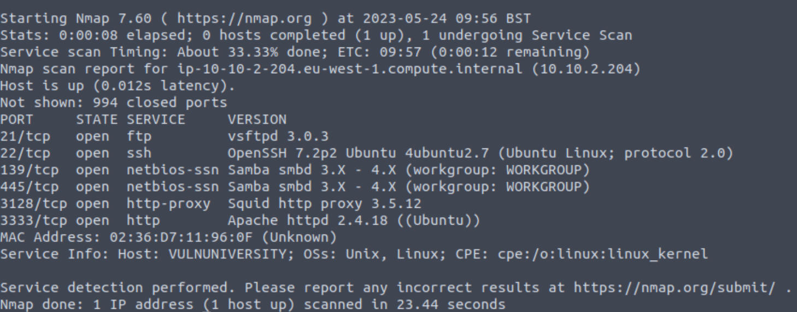
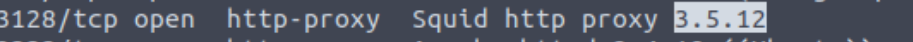
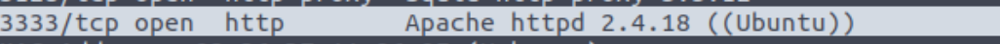

### Learn about active recon, web app attacks and privilege escalation.

## Task 1 Deploy the machine

- Deploy the machine.
> No answer needed

## Task 2 Reconnaissance

- There are many Nmap "cheatsheets" online that you can use too.
> No answer needed

-  Scan the box; how many ports are open?

> 6

- What version of the squid proxy is running on the machine?

>3.5.12

- How many ports will Nmap scan if the flag **-p-400** was used?
> 400

- What is the most likely operating system this machine is running?
> Ubuntu

- What port is the web server running on?

> 3333

- It's essential to ensure you are always doing your reconnaissance thoroughly before progressing. Knowing all open services (which can all be points of exploitation) is very important, don't forget that ports on a higher range might be open, so constantly scan ports after 1000 (even if you leave checking in the background).
> No answer needed

- What is the flag for enabling verbose mode using Nmap?
> -V

## Task 3 Locating directories using Gobuster

- Now let's run Gobuster with a wordlist using gobuster dir -u http://10.10.2.204:3333 -w word list location

> No answer needed

- What is the directory that has an upload form page?

> /internal/

## Task 4 Compromise the Webserver

- What common file type you'd want to upload to exploit the server is blocked? Try a couple to find out.
