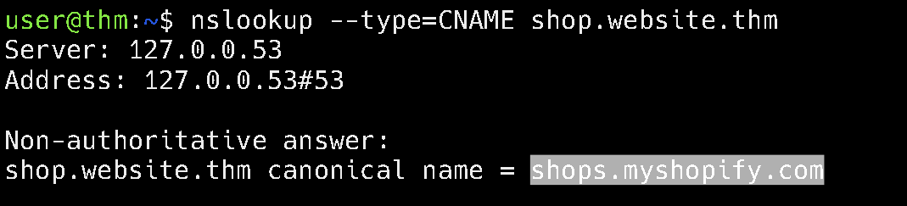

## Task 1 What is DNS?

- What does DNS stand for?
	Domain Name System

## Task 2 Domain Hierarchy

- What is the maximum length of a subdomain?
> 63

- Which of the following characters cannot be used in a subdomain ( 3 b _ - )?
> _

- What is the maximum length of a domain name?
>	253

- What type of TLD is .co.uk?
>	ccTLD

## Task 3 Record Types

- What type of record would be used to advise where to send email?
>	MX

- What type of record handles IPv6 addresses?
>	AAAA

## Task 4 Making A Request

- What field specifies how long a DNS record should be cached for?
>	TTL

- What type of DNS Server is usually provided by your ISP?
>	Recursive

- What type of server holds all the records for a domain?
>	Authoritative

## Task 5 Practical

- What is the CNAME of shop.website.thm?

	shops.myshopify.com

- What is the value of the TXT record of website.thm?

	THM{7012BBA60997F35A9516C2E16D2944FF}

- What is the numerical priority value for the MX record?

Swap to MX type record to get the MX priority value

	30

- What is the IP address for the A record of www.website.thm?

Swap to type A record to find out the IPv4 address

	10.10.10.10
