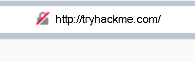
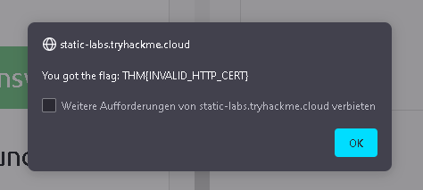
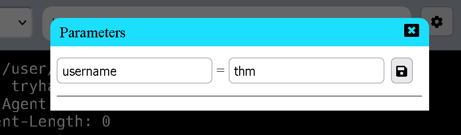
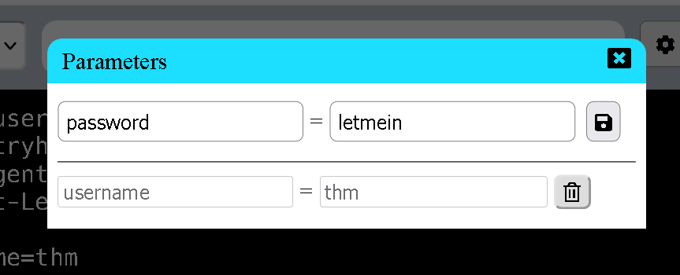

## Task 1 What is HTTP(S)?

- Task 1 What is HTTP(S)?
> Hypertext Transfer Protocol

- What does the S in HTTPS stand for?
> Secure

- On the mock webpage on the right there is an issue, once you've found it, click on it. What is the challenge flag?

Click on the lock symbol to check the certificate

> THM{INVALID_HTTP_CERT}

## Task 2 Requests And Responses

- What HTTP protocol is being used in the above example?

We can see the HTTP protocol that is being used in the first line of the example response

> HTTP/1.1

- What HTTP protocol is being used in the above example?

Again, it is shown inside of the response. 

> Content-Length

## Task 3 HTTP Methods

- What method would be used to create a new user account?
> Post

- What method would be used to update your email address?
> Put

- What method would be used to remove a picture you've uploaded to your account?
> Delete

- What method would be used to view a news article?
> Get

## Task 4 HTTP Status Codes

- What response code might you receive if you've created a new user or blog post article?
> 201

- What response code might you receive if you've tried to access a page that doesn't exist?
> 404

- What response code might you receive if the web server cannot access its database and the application crashes?
> 503

- What response code might you receive if you try to edit your profile without logging in first?
> 401

## Task 5 Headers

- What header tells the web server what browser is being used?
> User-Agent

- What header tells the browser what type of data is being returned?
> Content-Type

- What header tells the web server which website is being requested?
> Host

## Task 6 Cookies

- Which header is used to save cookies to your computer?
> Set-Cookie

## Task 7 Making Requests

- Make a GET request to /room

> THM{YOU'RE_IN_THE_ROOM}

- Make a GET request to /blog and using the gear icon set the id parameter to 1 in the URL field

Same as the previous question but this time we insert the id with the gear button

> THM{YOU_FOUND_THE_BLOG}

- Make a DELETE request to /user/1

> THM{USER_IS_DELETED}

- Make a PUT request to /user/2 with the username parameter set to admin

First we put in the username = admin parameter

Afterwards we insert the put request

> THM{USER_HAS_UPDATED}

- POST the username of thm and a password of letmein to /login

First we set the parameter of "username" to "thm"

Then we input another paramter the "password" as "letmein"

We then make the POST request to gain the last flag

> THM{HTTP_REQUEST_MASTER}

