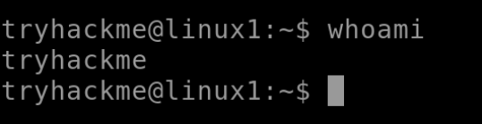
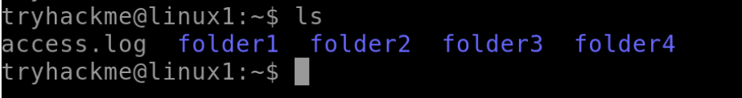
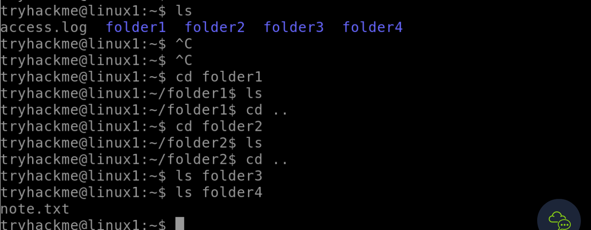

## Task 1 Introduction

- Let's get started!
> No answer needed

## Task 2 A Bit of Background on Linux

- Research: What year was the first release of a Linux operating system?

> 1991

## Task 3 Interacting With Your First Linux Machine (In-Browser)

- I've deployed my first Linux machine!
> No answer needed

## Task 4 Running Your First few Commands

- If we wanted to output the text "**TryHackMe**", what would our command be?
> echo TryHackMe

- What is the username of who you're logged in as on your deployed Linux machine?

We find this out with the "whoami" command

> tryhackme

## Task 5 Interacting With the Filesystem!

- On the Linux machine that you deploy, how many folders are there?

We find it out with the "ls" command

> 4

- Which directory contains a file?

We can use "ls {foldername}" or "cd" into the folder and "ls" the directory

> folder4

- What is the contents of this file?

"cat" the note.txt file to view the info of the file.

> Hello World!

- Use the cd command to navigate to this file and find out the new current working directory. What is the path?

Use the "pwd" command to print the current working directory.

> /home/tryhackme/folder4

## Task 6 Searching for Files

- Use grep on "access.log" to find the flag that has a prefix of "THM". What is the flag?

To get the flag we need to open the file first with the "cat" command and then pipe the "grep" command ontop of it.

> THM{ACCESS}

- And I still haven't found what I'm looking for!
> No answer needed

## Task 7 An Introduction to Shell Operators

- If we wanted to run a command in the background, what operator would we want to use?
	&

- If I wanted to replace the contents of a file named "passwords" with the word "password123", what would my command be?

> echo passwords > password123

- Now if I wanted to add "tryhackme" to this file named "passwords" but also keep "passwords123", what would my command be

> echo passwords123 >> tryhackme

- Now use the deployed Linux machine to put these into practice
> No answer needed

## Task 8 Conclusions & Summaries

- I'll have a play around!
> No answer needed

## Task 9 Linux Fundamentals Part 2

- Terminate the machine deployed in this room from task 3.
> No answer needed

- Join [Linux Fundamentals Part 2!](https://tryhackme.com/jr/linuxfundamentalspart2)
> No answer needed

