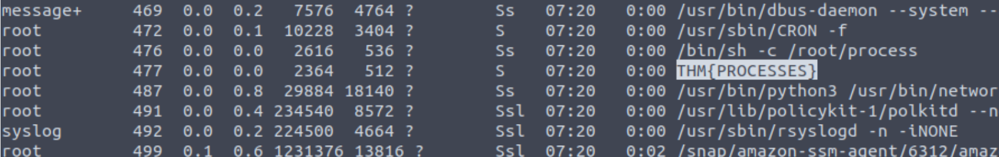

## Task 1 Introduction

- Let's proceed!
> No answer needed

## Task 2 Deploy Your Linux Machine

- I've logged into the Linux Fundamentals Part 3 machine using SSH and have deployed the AttackBox successfully!
> No answer needed

## Task 3 Terminal Text Editors

- Create a file using Nano
> No answer needed

- Edit "task3" located in "tryhackme"'s home directory using Nano. What is the flag?

> THM{TEXT_EDITORS}

## Task 4 General/Useful Utilities

- Ensure you are connected to the deployed instance (10.10.198.82)
> No answer needed

- Now, use Python 3's "HTTPServer" module to start a web server in the home directory of the "tryhackme" user on the deployed instance.
> No answer needed

- Download the file .flag.txt) onto the TryHackMe AttackBox. What are the contents?

Open the Python HTTPServer in one terminal and then open another terminal to input the "wget" command.

Afterwards you can just "cat" the "".flag.txt" file.

> THM{WGET_WEBSERVER}

- Use Ctrl + C to stop the Python3 HTTPServer module once you are finished.
> No answer needed

## Task 5 Processes 101

- Task 5 Processes 101
> No answer needed

- If we were to launch a process where the previous ID was "300", what would the ID of this new process be?

Since there are 300 processes and we add one on top of that it means that we now have 301 processes running.

> 301

- If we wanted to **cleanly** kill a process, what signal would we send it?
> SIGTERM

- Locate the process that is running on the deployed instance (10.10.198.82). What flag is given?

For that we have to run the "ps aux" command to list out all the running processes to see where the flag is.

> THM{PROCESSES}

- What command would we use to stop the service "myservice"?
> systemctl stop myservice

- What command would we use to start the same service on the boot-up of the system?
> systemctl enable myservice

- What command would we use to bring a previously backgrounded process back to the foreground?
> fg

## Task 6 Maintaining Your System: Automation

- Ensure you are connected to the deployed instance and look at the running crontabs.
> No answer needed

- When will the crontab on the deployed instance (10.10.198.82) run?
> @reboot

## Task 7 Maintaining Your System: Package Management

- Since TryHackMe instances do not have an internet connection...this task only requires you to read through the material.
> No answer needed

## Task 8 Maintaining Your System: Logs

- Look for the apache2 logs on the deployable Linux machine
> No answer needed

- What is the IP address of the user who visited the site?

Find out which accesslog you are able to access. Then try to cat the access log and find valuable information.

> 10.9.232.111

- What file did they access?

> catsanddogs.jpg

## Task 9 Conclusions & Summaries

- Terminate the machine deployed in this room from task 2.
> No answer needed

- Continue your learning in other Linux-dedicated rooms
> No answer needed

