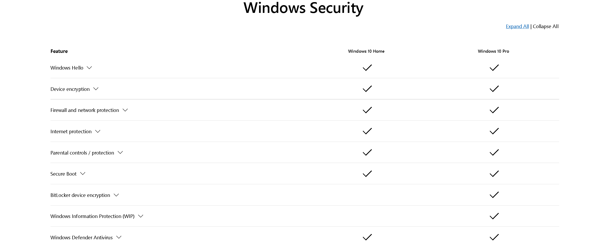

## Task 1 Introduction to Windows

- Read above and start the virtual machine.
> No answer needed

## Task 2 Windows Editions

- What encryption can you enable on Pro that you can't enable in Home?

> BitLocker

## Task 3 The Desktop (GUI)

- Which selection will hide/disable the Search box?

Press rightclick on the taskbar

> hidden

- Which selection will hide/disable the Task View button?

Press rightclick again and look for the "Show Task View Button" option and disable it

> Show Task View Button

- Besides Clock and Network, what other icon is visible in the Notification Area?
> Action Center

## Task 4 The File System

Windows uses NTFS as a file system

The permissions you can set up on NTFS volumes are:
-   **Full control**
-   **Modify**
-   **Read & Execute**
-   **List folder contents**
-   **Read**
-   **Write**

With rightclick, "Properties", going to the "Security" tab and then to the "Group or user names", you can change the permissions.

- What is the meaning of NTFS?
> New Technology File System

## Task 5 The Windows\System32 Folders

The system environment variable for the Windows directory is %windir%

System32 holds important files that are very important for the operating system to run.

- What is the system variable for the Windows folder?
> %windir%

## Task 6 User Accounts, Profiles, and Permissions

User accounts on Windows systems are either,
Administrators or Standard users.

- What is the name of the other user account?

Look for other users with the help of the command "lusrmgr.msc" with run.

Click on "Users" to see all the users of the system.

> tryhackmebilly

- What groups is this user a member of?

Access the properties first.

Then go to "Member of" to see which groups the user is a member of.

> Remote Desktop Users, Users

- What built-in account is for guest access to the computer?

The description of the user is the hint.

> Guest

- What is the account status?

We go again into the properties to find the answer.

> Account is disabled

## Task 7 User Account Control

We can control the privileges with User Account Control (UAC)

We can set up the UAC so that if someone tries to install a program that they need to authenticate themselves with the Administator password.

- What does UAC mean?
> User Account Control

## 