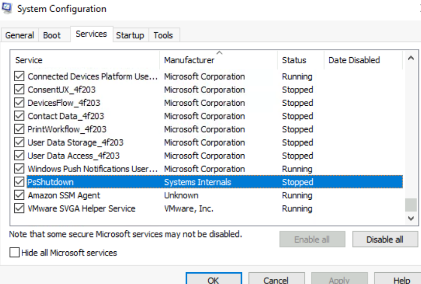
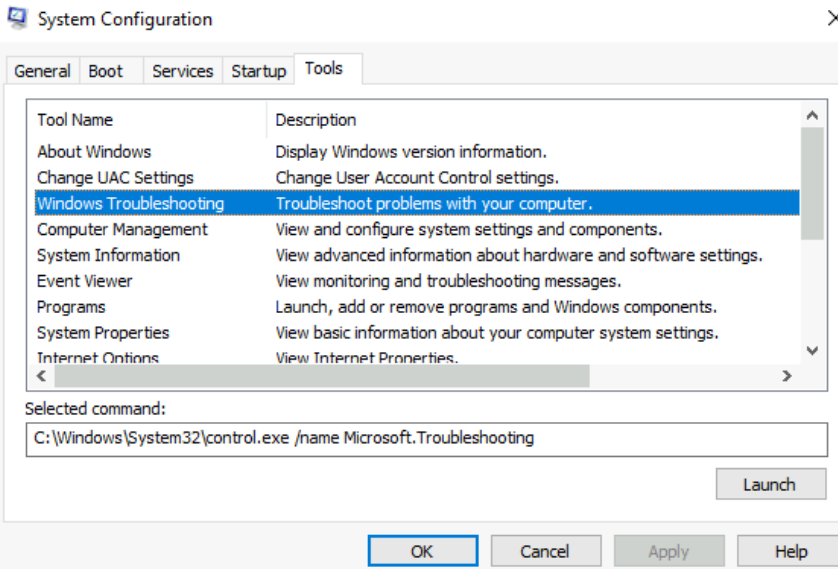
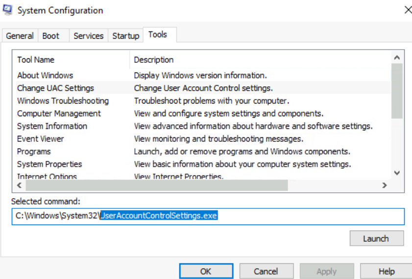
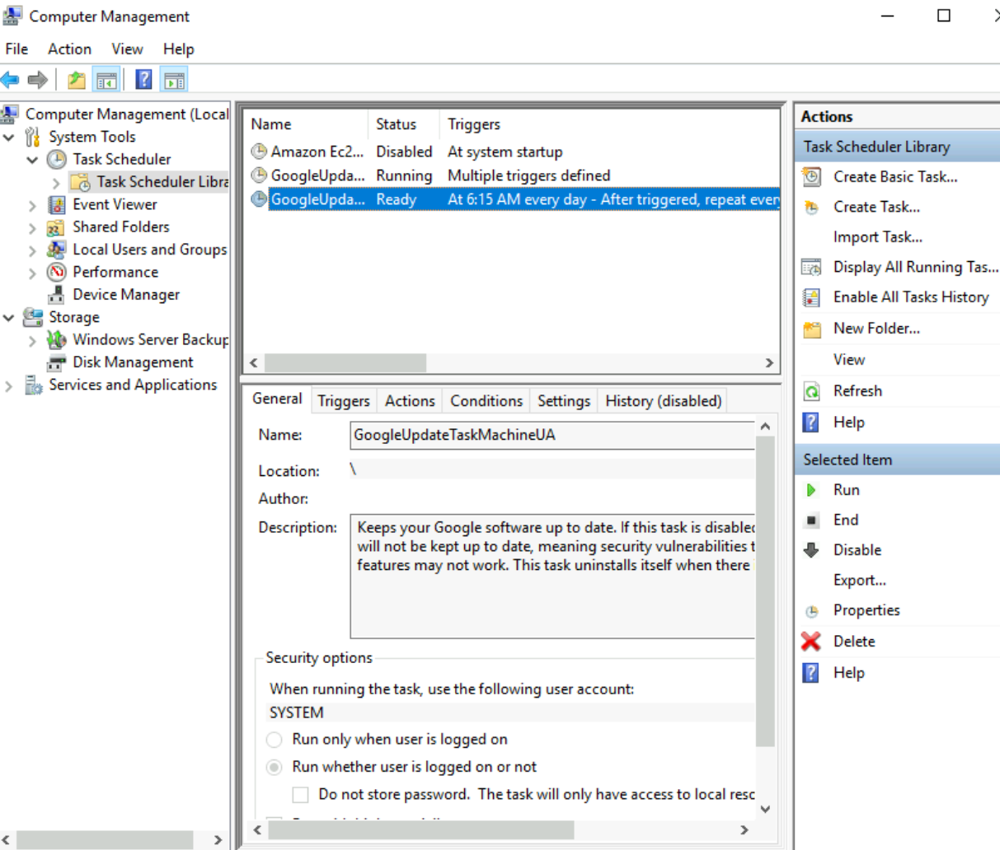

## Task 1 Introduction

- Read above and start the virtual machine.
> No answer needed

## Task 2 System Configuration

MSconfig has 5 tabs
1.  General
2.  Boot
3.  Services
4.  Startup
5.  Tools

- What is the name of the service that lists Systems Internals as the manufacturer?

> PsShutdown

- Whom is the Windows license registered to?
> Windows User

- What is the command for Windows Troubleshooting?

> C:\Windows\System32\control.exe /name Microsoft.Troubleshooting

- What command will open the Control Panel? (The answer is the name of .exe, not the full path)
> control.exe

## Task 3 Change UAC Settings

- What is the command to open User Account Control Settings? (The answer is the name of the .exe file, not the full path)

> UserAccountControlSettings.exe

## Task 4 Computer Management

The Task Schedule can create and manage commoon tasks for the computer to do automatically at a specific time.

The Event Viewer allows us to view events that have occured on the computer.

- What is the command to open Computer Management? (The answer is the name of the .msc file, not the full path)

> compmgmt.msc

- At what time every day is the GoogleUpdateTaskMachineUA task configured to run?

> 6:15 AM

- What is the name of the hidden folder that is shared?

> sh4r3dF0Ld3r

## Task 5 System Information

- What is the command to open System Information? (The answer is the name of the .exe file, not the full path)

> msinfo32.exe

- What is listed under System Name?

> THM-WINFUN2

- Under Environment Variables, what is the value for ComSpec?

> %SystemRoot%\system32\cmd.exe

