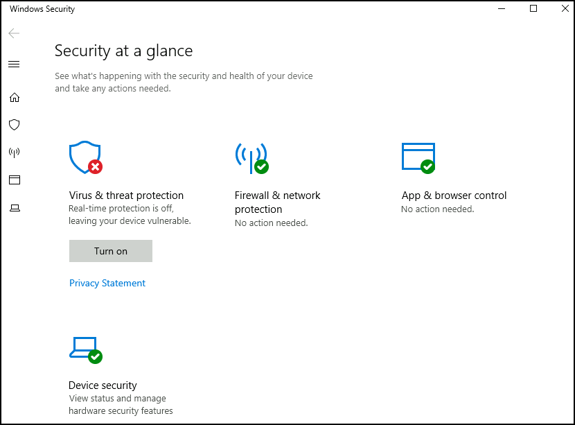

## Task 1 Introduction

- Read the above and start the virtual machine.
> No answer needed

## Task 2 Windows Updates

- There were two definition updates installed in the attached VM. On what date were these updates installed?

> 5/3/2021

## Task 3 Windows Security

- In the above image, which area needs immediate attention?

> Virus & Threat Protection

## Task 4 Virus & threat protection

- Specifically, what is turned off that Windows is notifying you to turn on?
> Real-time protection

## Task 5 Firewall & network protection

- If you were connected to airport Wi-Fi, what most likely will be the active firewall profile?
> Public Network

## Task 6 App & browser control

- Read the above.
> No answer needed

## Task 7 Device security

- What is the TPM?
> Trusted Platform Module

## Task 8 BitLocker

- What must a user insert on computers that **DO NOT** have a TPM version 1.2 or later?
> USB Startup Key

## Task 9 Volume Shadow Copy Service

- What is VSS?
> Volume Shadow Copy Service

## Task 10 Conclusion

- Read the above.
> No answer needed

