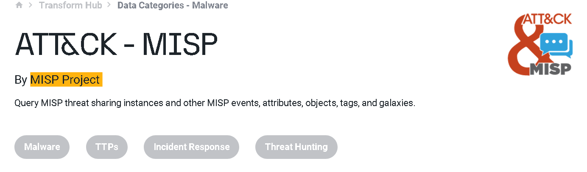

### Learn how to use DNS, advanced searching, Recon-ng, and Maltego to collect information about your target.

## Task 1 Introduction

- We suggest you start the AttackBox and experiment with every command and tool we demonstrate.
> No answer needed

## Task 2 Taxonomy of Reconnaissance

- Ensure you have a clear understanding of the different types of recon activities before proceeding.
> No answer needed

## Task 3 Built-in Tools

- `whois` to query the WHOIS database
- `nslookup`, `dig`, or `host` to query DNS servers

- When was `thmredteam.com` created (registered)? (YYYY-MM-DD)
Type in `whois thmredteam.com`

> 2021-09-24

- To how many IPv4 addresses does `clinic.thmredteam.com` resolve?

> 2

- To how many IPv6 addresses does `clinic.thmredteam.com` resolve?
> 2

## Task 4 Advanced Searching

- How would you search using Google for `xls` indexed for http://clinic.thmredteam.com?
> filetype:xls site:clinic.thmredteam.com

- How would you search using Google for files with the word `passwords` for http://clinic.thmredteam.com?
> "passwords" site:clinic.thmredteam.com

## Task 5 Specialized Search Engines

- What is the `shodan` command to get your Internet-facing IP address?

> shodan myip

## Task 6 Recon-ng

- How do you start `recon-ng` with the workspace `clinicredteam`?
> recon-ng -w clinicredteam

- How many modules with the name `virustotal` exist?
> 2

- There is a single module under `hosts-domains`. What is its name?
> migrate_hosts

- `censys_email_address` is a module that “retrieves email addresses from the TLS certificates for a company.” Who is the author?
> Censys Team

## Task 7 Maltego

- What is the name of the transform that queries NIST’s National Vulnerability Database?
> NIST NVD

- What is the name of the project that offers a transform based on ATT&CK?

> MISP Project

