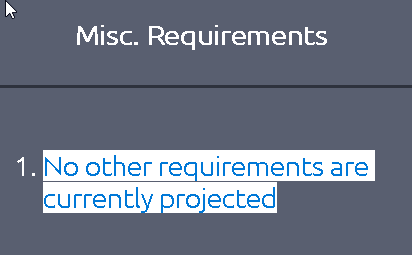

### Learn the steps and procedures of a red team engagement, including planning, frameworks, and documentation.

## Task 1 Introduction

- Read the above and continue to the next task.
> No answer needed

## Task 2 Defining Scope and Objectives

- Read the example client objectives and answer the questions below.
> No answer needed

- What CIDR range is permitted to be attacked?
> 10.0.4.0/22

- Is the use of white cards permitted? (Y/N)
> Y

- Are you permitted to access "*.bethechange.xyz?" (Y/N)
> N

## Task 3 Rules of Engagement

- Once downloaded, read the sample document and answer the questions below.
> No answer needed

- How many explicit restriction are specified?

> 3

- What is the first access type mentioned in the document?

> Phishing

- Is the red team permitted to attack 192.168.1.0/24? (Y/N)

> N

## Task 4 Campaign Planning

- Read the above and move on to engagement documentation.
> No answer needed

## Task 5 Engagement Documentation

- Read the above and move on to the upcoming engagement specific tasks.
> No answer needed

## Task 6 Concept of Operations

- Read the example CONOPS and answer the questions below.
> No answer needed

- Based on customer security posture and maturity, the TTP of the threat group: FIN6, will be employed throughout the engagement.
> No answer needed

- How long will the engagement last?
> 1 Month

- How long is the red cell expected to maintain persistence?
> 3 Weeks

- What is the primary tool used within the engagement?
> Cobalt Strike

## Task 7 Resource Plan

- Navigate to the "_View Site"_  button and read the provided resource plan. Once complete, answer the questions below.
> No answer needed

- When will the engagement end? (MM/DD/YYYY)

> 11/14/2021

- What is the budget the red team has for AWS cloud cost?

> $1000

- Are there any miscellaneous requirements for the engagement? (Y/N)

> N

## Task 8 Operations Plan

- Navigate to the "_View Site"_  button and read the provided operations plan. Once complete, answer the questions below.
> No answer needed

- What phishing method will be employed during the initial access phase?

> Spearphishing

- What site will be utilized for communication between the client and red cell?

> vectr.io

- If there is a system outage, the red cell will continue with the engagement. (T/F)

> F

## Task 9 Mission Plan

- Navigate to the "_View Site"_  button and read the provided mission plan. Once complete, answer the questions below.
> No answer needed

- When will the phishing campaign end? (mm/dd/yyyy)

> 10/23/2021

- Are you permitted to attack 10.10.6.78? (Y/N)

> N

- When a stopping condition is encountered, you should continue working and determine the solution yourself without a team lead. (T/F)

> F

## Task 10 Conclusion

- Read the above and continue learning!
> No answer needed

