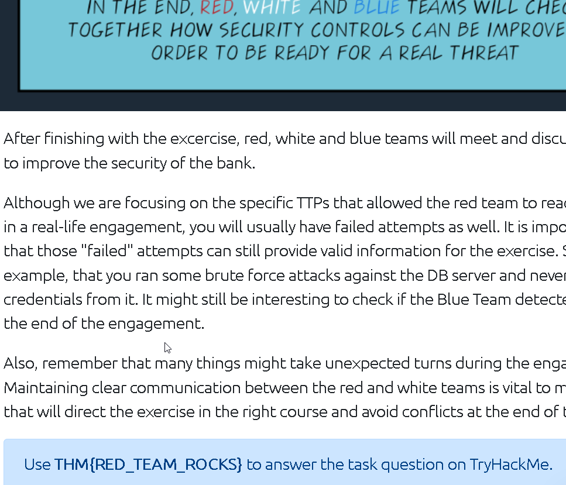

### Learn about the basics of a red engagement, the main components and stakeholders involved, and how red teaming differs from other cyber security engagements.

## Task 1 Introduction

- Click to continue to the next task
> No answer needed

## Task 2 Vulnerability Assessment and Penetration Tests Limitations

Red Teaming is a more realistic approach to security.

- Would vulnerability assessments prepare us to **detect** a real attacker on our networks? (Yay/Nay)
> Nay

- During a penetration test, are you concerned about being detected by the client? (Yay/Nay)
> Nay

- Highly organised groups of skilled attackers are nowadays referred to as ...
> Advanced Persistent Threats

## Task 3 Red Team Engagements

- The goals of a red team engagement will often be referred to as flags or...
> Crown Jewels

- During a red team engagement, common methods used by attackers are emulated against the target. Such methods are usually called TTPs. What does TTP stand for?
> Tactics, Techniques and Procedures

- The main objective of a red team engagement is to detect as many vulnerabilities in as many hosts as possible (Yay/Nay)
> Nay

## Task 4 Teams and Functions of an Engagement

- What cell is responsible for the offensive operations of an engagement?
> Red Cell

- What cell is the trusted agent considered part of?
> White Cell

## Task 5 Engagement Structure

- If an adversary deployed Mimikatz on a target machine, where would they be placed in the Lockheed Martin cyber kill chain?
> Installation

- What technique's purpose is to exploit the target's system to execute code?
> Exploitation

## Task 6 Overview of a Red Team Engagement

> THM{RED_TEAM_ROCKS}

## Task 7 Conclusion

- Read the above and continue learning!
> No answer needed

