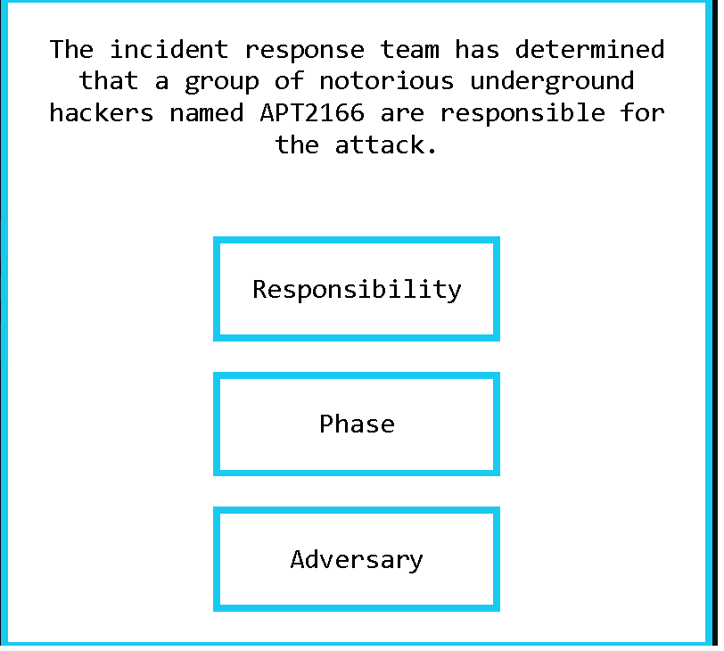

### Learn about the four core features of the Diamond Model of Intrusion Analysis: adversary, infrastructure, capability, and victim.

## Task 1 Introduction

The Diamond Model is composed of four core features: adversary, infrastructure, capability, and victim, and establishes the fundamental atomic element of any intrusion activity.
Carries the concepts of intrusion analysis and adversary operations.
The Diamond Model helps to identify elemnts of an intrusion.

- Read the above.
> No answer needed

## Task 2 Adversary

An Adversary is also known as an attacker/enemy. The one who starts the attack.
There are adversary operators and customers.
Operators are the "hackers".
Customers are the ones that benefit fromm the activity that is done by for example the "hackers".

- What is the term for a person/group that has the intention to perform malicious actions against cyber resources?
> Advesary Operators

- What is the term of the person or a group that will receive the benefits from the cyberattacks?
> Advesary Customers

## Task 3 Victim

The Victim is the target of the attack.
Victim Personae are people and organizations that get targeted.
Victim Assets are the systems, networks, email addresses etc.

- What is the term that applies to the Diamond Model for organizations or people that are being targeted?
> Victim Personae

## Task 4 Capability

Capability is the skill, tools and techniques used by the adversary in the event.
**Capability Capacity** is all of the vulnerabilities and exposures that the individual capability can use.
An **Adversary Arsenal** is a set of capabilities that belong to an adversary. The combined capacities of an adversary's capabilities make it the adversary's arsenal.

- Provide the term for the set of tools or capabilities that belong to an adversary.
> Adversary Arsenal

## Task 5 Infrastructure

Infrastructure is the software or hardware.
Type 1 Infrastructure is controlled or owned by the adversary.
Type 2 Infrastructure is controlled by an intermediary.

- To which type of infrastructure do malicious domains and compromised email accounts belong?
> Type 2 Infrastructure

- What type of infrastructure is most likely owned by an adversary?
> Type 1 Infrastructure

## Task 6 Event Meta Features

Six features can be added to the Diamond Model.
-  Timestamps
	- Date and time of the event.
- Phase
	- Phases of an attack or breach
- Result
- Direction
	- Describes host-based and network based events.
- Methodology
	- Describes callsification of intrusion.
- Resources
	- One or more external resources.

- What meta-feature does the axiom "Every malicious activity contains two or more phases which must be successfully executed in succession to achieve the desired result" belong to?
> Phase

- You can label the event results as "success", "failure", and "unknown". What meta-feature is this related to?
> Result

- To what meta-feature is this phrase applicable "Every intrusion event requires one or more external resources to be satisfied prior to success"?
> Resources

## Task 7 Social-Political Component

- Read the above.
> No answer needed

## Task 8 Technology Component

- Read the above.
> No answer needed

## Task 9 Practice Analysis

- **Complete all eight areas of the diamond**. What is the flag that is displayed to you?

Since this is showing us a timeline of when the attack has happend it must be Timeline.

It states that the people or rather the adversaries have been found so we will take "Adversary" here.

The IT systems are the victims of the attack so we take "Victim".

This is a Resource that is used to help to give us further information about the attack.

This is the result of the actions of the hackers.

The answer is Lockheed Martin's Cyber Kill Chain

This is the methodology that they have used in the attack.

This shows us what the hackers were capable of, of doing.

At the end we gain the flag of the practice analysis.

- **Complete all eight areas of the diamond**. What is the flag that is displayed to you?
> THM{DIAMOND_MODEL_ATTACK_CHAIN}

## Task 10 Conclusion

- Read the above.
> No answer needed

