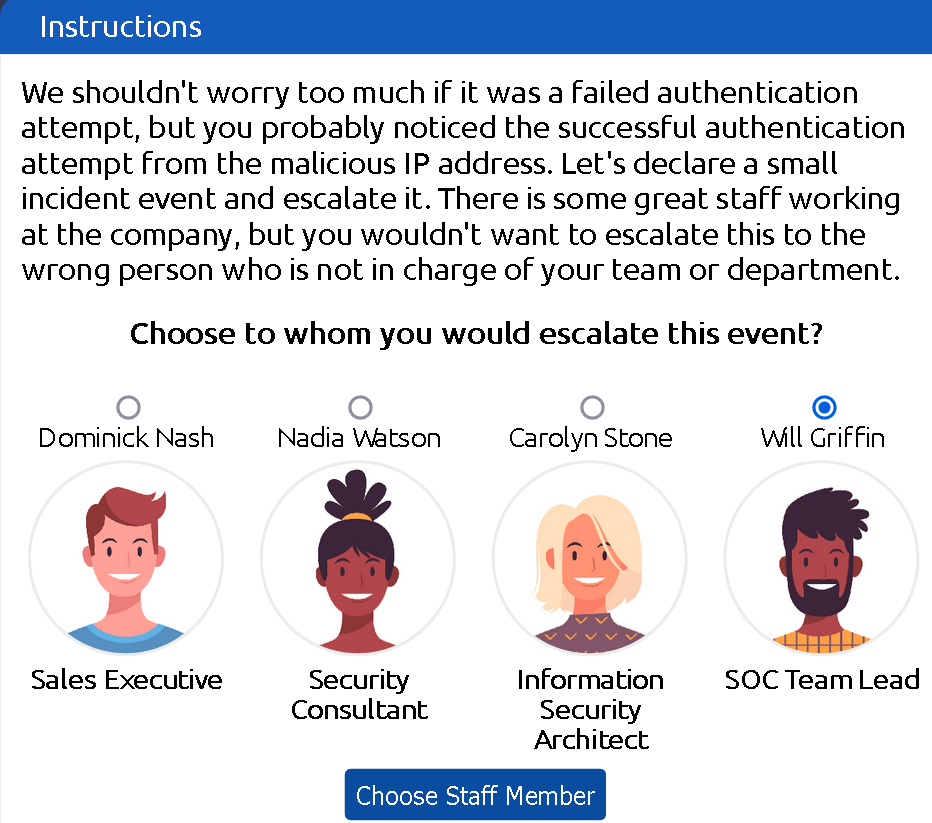
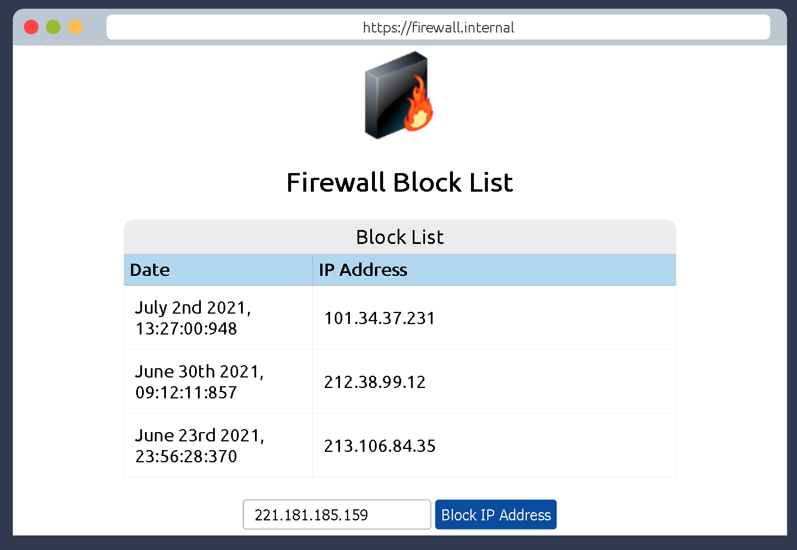
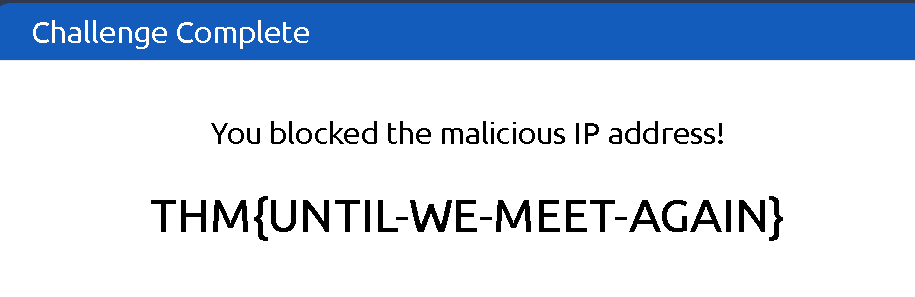

### Play through a day in the life of a Junior Security Analyst, their responsibilities and qualifications needed to land a role as an analyst.

## Task 1 A career as a Junior (Associate) Security Analyst

- What will be your role as a Junior Security Analyst?
> Triage Specialist

## Task 2 Security Operations Center (SOC)

A SOC (Security Operations Center) is to investigate, monitor, prevent, and respond to threats in the cyber realm 24/7 or around the clock.
You need to be constnatly up to date about the latest cybersecurity threats.
SOC teams use SIEM (Security information and event management) and EDR (Endpoint Detection and Response) tools to monitor suspicious and malicious activities on the network.

- Read the above.
> No answer needed

## Task 3 A day In the life of a Junior (Associate) Security Analyst

- Click on the green View Site button in this task to open the Static Site Lab and navigate to the security monitoring tool on the right panel to try to identify the suspicious activity.
> No answer needed

- What was the malicious IP address in the alerts?

This is the malicious IP address.

> 221.181.185.159

- To whom did you escalate the event associated with the malicious IP address?

We should be  escalating the event to the Team Lead for further instructions on how to operate further.

> Will Griffin

- After blocking the malicious IP address on the firewall, what message did the malicious actor leave for you?

Lets block the malicious IP address in our firewall.

We then receive the flag:

> ## THM{UNTIL-WE-MEET-AGAIN}

