### This room will discuss the various resources MITRE has made available for the cybersecurity community.

## Task 1 Introduction to MITRE

- _Read the above_
> No answer needed

## Task 2 Basic Terminology

APT means Advanced Persistent Threat.
This is a group, or country, that engages in long-term attacks against organizations and/or countries.

TTP means Tactics, Techniques, and Procedures.
Tactics is the goal of the hackers.
Technique is how they achieve the goal.
Procedure is how the technique gets executed.

- _Read the above_
> No answer needed

## Task 3 ATT&CK® Framework

We can use the ATT&CK Matrix to map a threat group to their tactics and techniques

- Besides blue teamers, who else will use the ATT&CK Matrix?
> Red Teamers

- What is the ID for this technique?
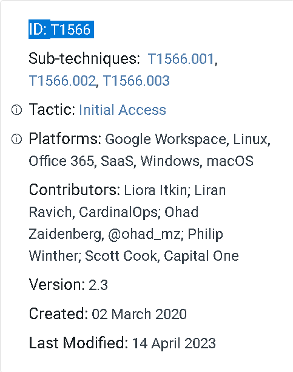
> T1566

- Based on this technique, what mitigation covers identifying social engineering techniques?
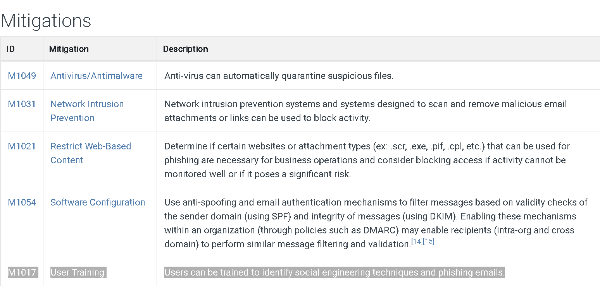
> User Training

- What are the data sources for Detection? **(**format: source1,source2,source3 with no spaces after commas)
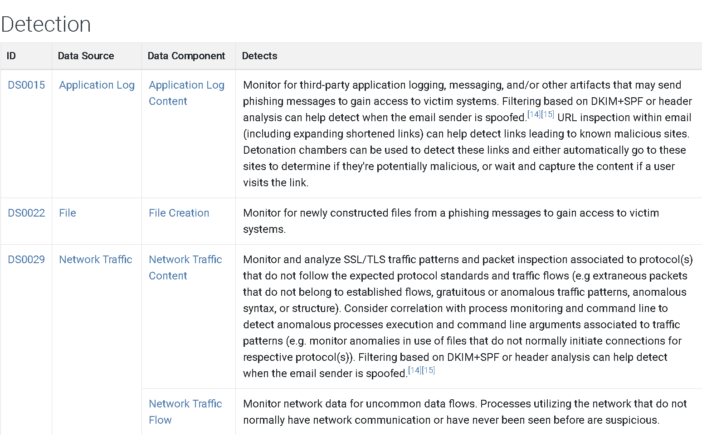
> Application Log,File,Network Traffic

- What groups have used spear-phishing in their campaigns? (format: group1,group2)
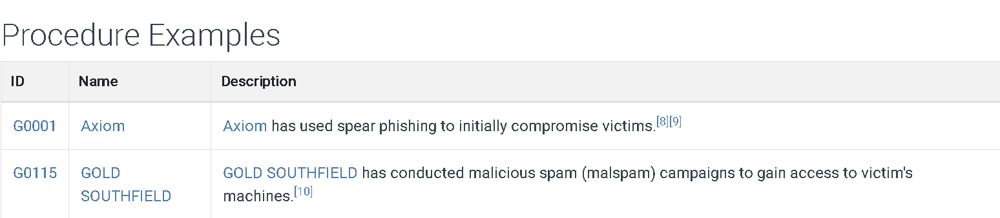
> Axiom,GOLD SOUTHFIELD 

- Based on the information for the first group, what are their associated groups?
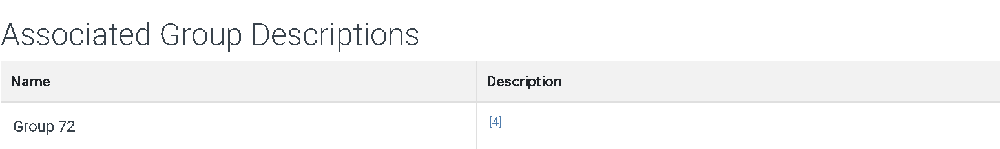
>Group 72

- What software is associated with this group that lists phishing as a technique?
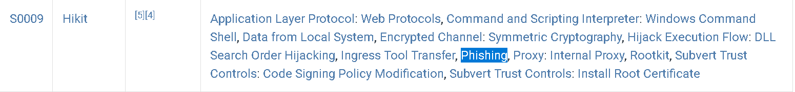
> Hikit

- What is the description for this software?
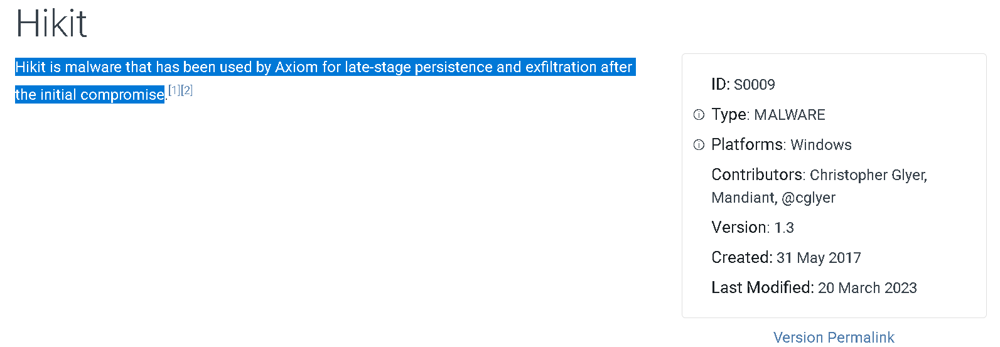
> Hikit is malware that has been used by Axiom for late-stage persistence and exfiltration after the initial compromise

- This group overlaps (slightly) with which other group?
> Winnti Group

- How many techniques are attributed to this group?
> 15

## Task 4 CAR Knowledge Base

- For the above analytic, what is the pseudocode a representation of?

> Splunk Search

- What tactic has an ID of TA0003?
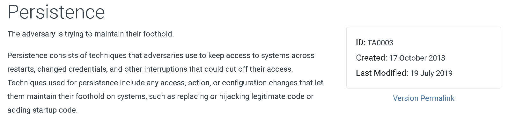
> Persistence

- What is the name of the library that is a collection of Zeek (BRO) scripts?
> BZAR

- What is the name of the **technique** for running executables with the same hash and different names?
> Masquerading

- Examine CAR-2013-05-004, besides Implementations, what additional information is provided to analysts to ensure coverage for this technique?

> Unit Tests

## Task 5 MITRE Engage

- Under Prepare, what is ID SAC0002?
> Persona Creation

- What is the name of the resource to aid you with the engagement activity from the previous question?
> PERSONA PROFILE WORKSHEET

- Which engagement activity baits a specific response from the adversary?
> Lures

- What is the definition of Threat Model?
> A risk assessment that models organizational strengths and weaknesses

## Task 6 MITRE D3FEND

- What is the first MITRE ATT&CK technique listed in the ATT&CK Lookup dropdown?
> Data Obfuscation

- In D3FEND Inferred Relationships, what does the ATT&CK technique from the previous question produce?
> Outbound Internet Network Traffic

## Task 7 ATT&CK® Emulation Plans

- In Phase 1 for the APT3 Emulation Plan, what is listed first?
> C2 Setup

- Under Persistence, what binary was replaced with cmd.exe?
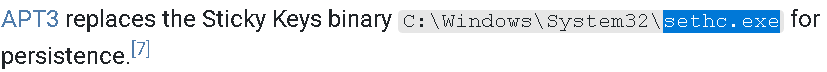
> sethc.exe

- Examining APT29, what  C2 frameworks are listed in Scenario 1 Infrastructure? (format: tool1,tool2)
> Pupy,Metasploit Framework

- What C2 framework is listed in Scenario 2 Infrastructure?
> PoshC2

- Examine the emulation plan for Sandworm. What webshell is used for Scenario 1? Check MITRE ATT&CK for the Software ID for the webshell. What is the id? (format: webshell,id)
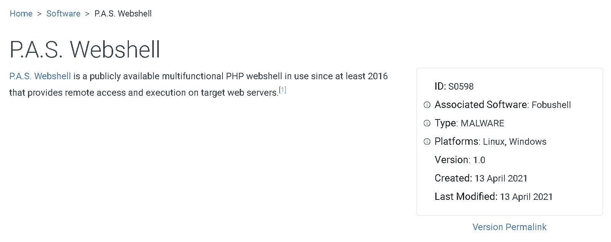
> P.A.S.,S0598

## Task 8 ATT&CK® and Threat Intelligence

- What is a group that targets your sector who has been in operation since at least 2013?
> APT33

- As your organization is migrating to the cloud, is there anything attributed to this APT group that you should focus on? If so, what is it?
> Cloud Accounts

- What tool is associated with the technique from the previous question?
> Ruler

- Referring to the technique from question 2, what mitigation method suggests using SMS messages as an alternative for its implementation?
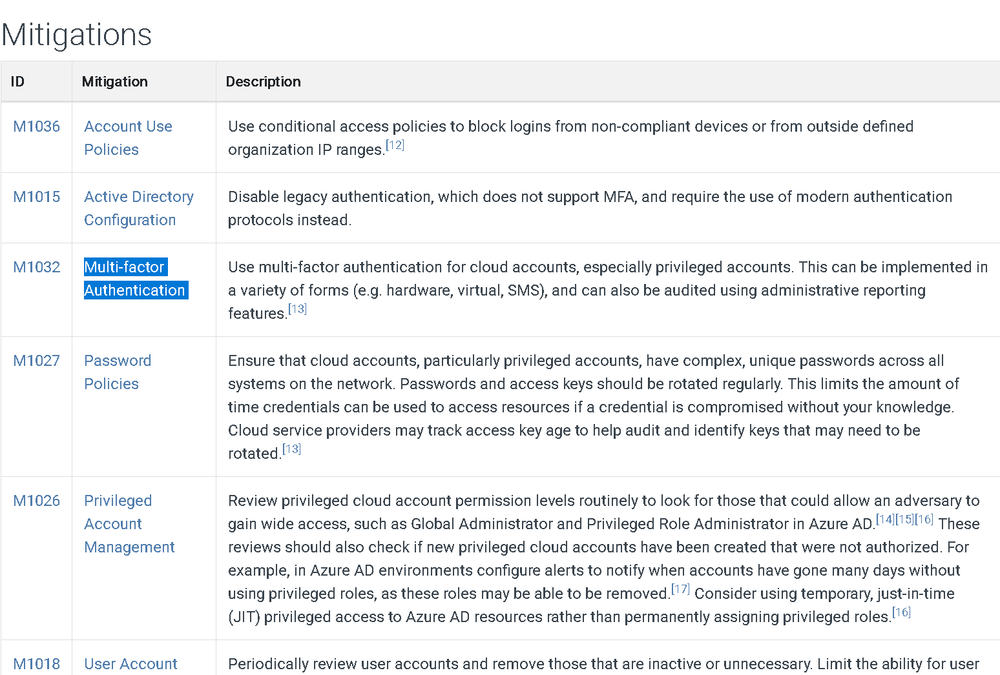
> Multi-factor Authentication

- What platforms does the technique from question #2 affect?
> Azure AD, Google Workspace, IaaS, Office 365, SaaS

## Task 9 Conclusion

- _Read the above_
> No answer needed

