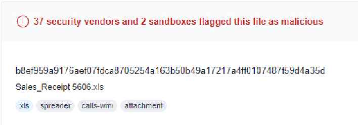
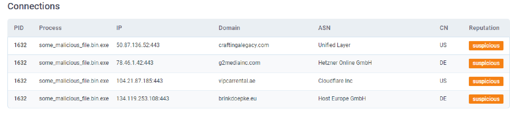
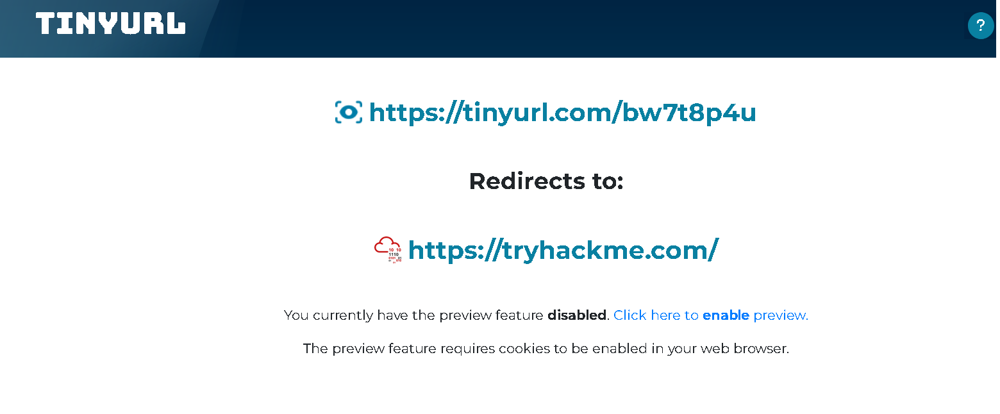
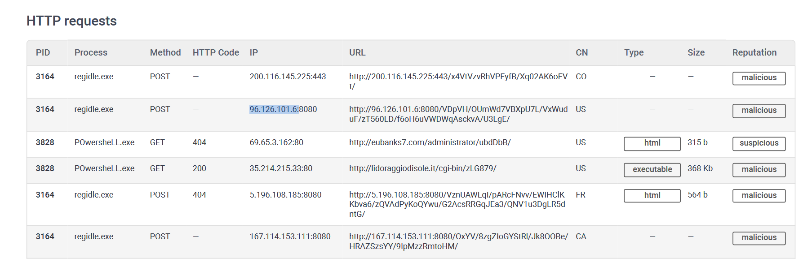
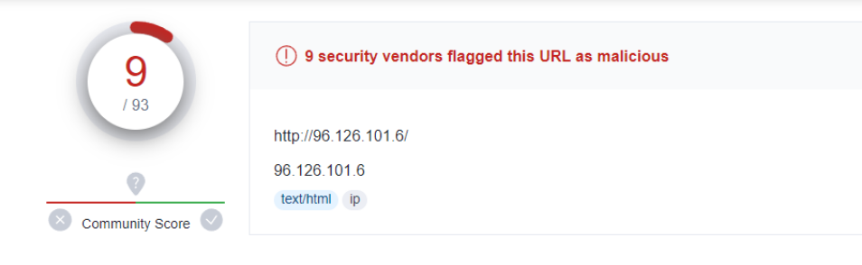

### Learn what is the Pyramid of Pain and how to utilize this model to determine the level of difficulty it will cause for an adversary to change the indicators associated with them, and their campaign.

## Task 1 Introduction

- Read the above.
> No answer needed

## Task 2 Hash Values (Trivial)

A hash value is the result of a hashing algorithm.

- Analyse the report associated with the hash "b8ef959a9176aef07fdca8705254a163b50b49a17217a4ff0107487f59d4a35d" [here.](https://assets.tryhackme.com/additional/pyramidofpain/t3-virustotal.pdf) What is the filename of the sample?

We can see the name of the file here:

> Sales_Receipt 5606.xls

## Task 3 IP Address (Easy)

Fast Flux is a DNS technique used by botnets to hide phishing, web proxying, malware delivery, and malware communication activities behind compromised hosts acting as proxies.
This makes finding the communication between malware and the control server very challenging to be discovered.

**Read the following report (generated from [any.run](https://any.run)) for this sample [here](https://assets.tryhackme.com/additional/pyramidofpain/task3-anyrun.pdf) to answer the questions below:**

- What IP address does the malicious process (**PID 1632**) attempt to communicate with?

We have here the DNS requests that the malicious process uses to try to communicate with someone.

> 50.87.136.52

- What is the domain name this malicious process ((PID 1632) attempts to communicate with?

We can find the domain name here:

> craftingalegacy.com

## Task 4 Domain Names (Simple)

Punycode is a way of converting words that cannot be written in ASCII, into a Unicode ASCII encoding.

adidas.de is the real website.
adıdas.de is the fake punycode website.

Attackers will use URL shorteners to hide the suspicious link.

At the end of a shortened link type a "+" to see the full link.

- Go to [this report on app.any.run](https://app.any.run/tasks/a66178de-7596-4a05-945d-704dbf6b3b90) and provide the first malicious URL request you are seeing, you will be using this report to answer the remaining questions of this task.

The first one is the craftingalegacy.com one.

> craftingalegacy.com

- What term refers to an address used to access websites?
> Domain Names

- What type of attack uses Unicode characters in the domain name to imitate the a known domain?
> Punycode Attack

- Provide the redirected website for the shortened URL using a preview: https://tinyurl.com/bw7t8p4u

To answer this question just add a "+" at the end of the URL shortener.
So https://tinyurl.com/bw7t8p4u
Turns to https://tinyurl.com/bw7t8p4u+ 

We then get sent to this website:

> https://tryhackme.com/

## Task 5 Host Artifacts (Annoying)

- A security vendor has analysed the malicious sample for us. Review the report [here](https://assets.tryhackme.com/additional/pyramidofpain/task5-report.pdf) to answer the following questions.
> No answer needed

- A process named **regidle.exe** makes a POST request to an IP address on **port 8080**. What is the IP address?
Here is a list of all the requests by regidle.exe:

> 96.126.101.6

- The actor drops a malicious executable (EXE). What is the name of this executable?

> G_jugk.exe

- Look at this [report](https://assets.tryhackme.com/additional/pyramidofpain/vtotal2.png) by Virustotal. How many vendors determine this host to be malicious?

> 9

## 