### Introducing cyber threat intelligence and related topics, such as relevant standards and frameworks.

## Task 1 Introduction

- Ready to get started!
> No answer needed

## Task 2 Cyber Threat Intelligence

Cyber Threat Intelligence (CTI) is evidence-based knowledge about adversaries.
The goal of CTI is to understand the relationship the adversary has to your operational environment and how to defend it.
-   Who’s attacking you?
-   What are their motivations?
-   What are their capabilities?
-   What artefacts and indicators of compromise (IOCs) should you look out for?

Strategic Intel looks into an organisation's threat landscape and maps out the risk areas based on trends.
Technical Intel looks at evidences.
Tactial Intel assess tactics, techniques, and procedures (TTPs) of the adversary.
Operational Intel looks at the motives of the adversary.

- What does CTI stand for?
> Cyber Threat Intelligence

- IP addresses, Hashes and other threat artefacts would be found under which Threat Intelligence classification?
> Technical Intel

## Task 3 CTI Lifecycle

There is a six-phase cycle in the threat intel process.
- Direction
- Collection
- Processing
- Analysis
- Dissemination
- Feedback

- At which phase of the CTI lifecycle is data converted into usable formats through sorting, organising, correlation and presentation?
> Processing

- During which phase do security analysts get the chance to define the questions to investigate incidents?
> Direction

## Task 4 CTI Standards & Frameworks

- What sharing models are supported by TAXII?
> Collection and Channel

- When an adversary has obtained access to a network and is extracting data, what phase of the kill chain are they on?
> Actions on Objectives

## Task 5 Practical Analysis

- What was the source email address?
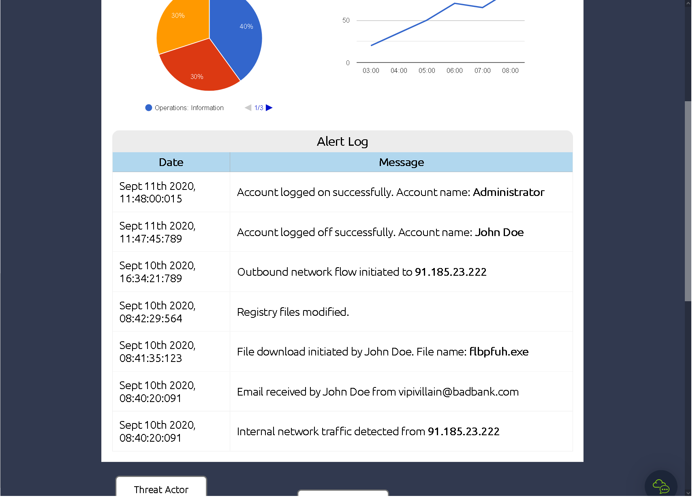

We have alot of data on our SIEM which we can use to answer all the questions below.

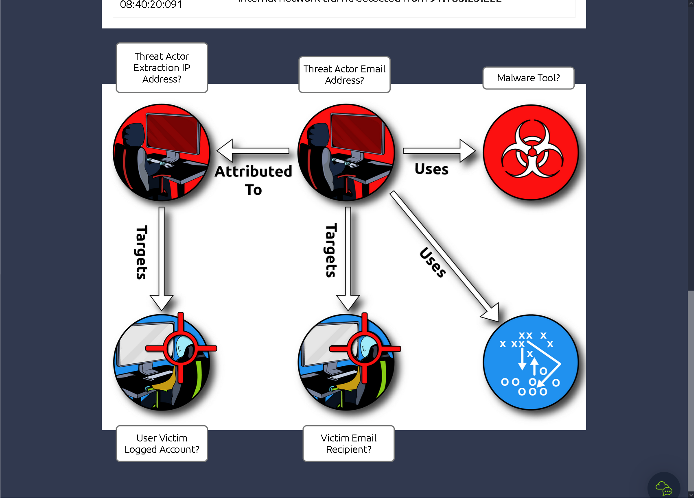

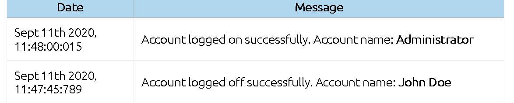

First we can see here that the attacker logged in into the "Administrator" account and logged off from the "John Doe" account.

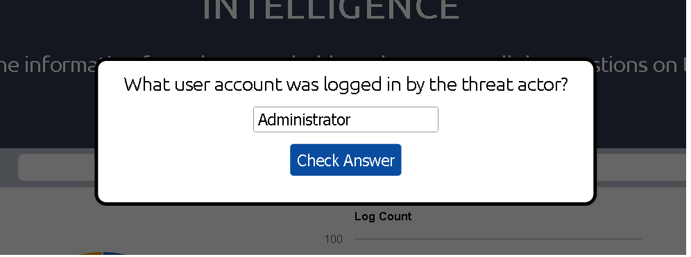

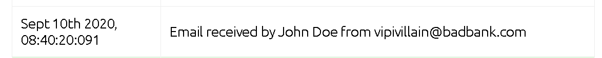

The Email recipient seems to be here.

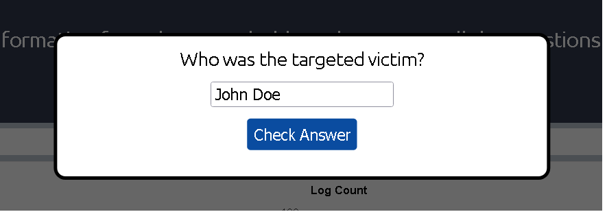

The Ip of the attacker can be found here:

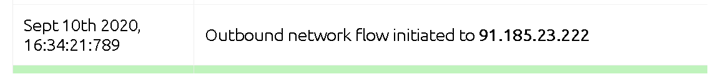

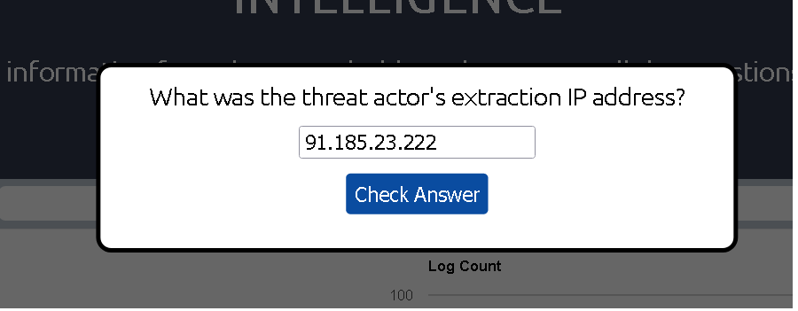

We also saw in one of the previous pictures the email address that the attacker used.

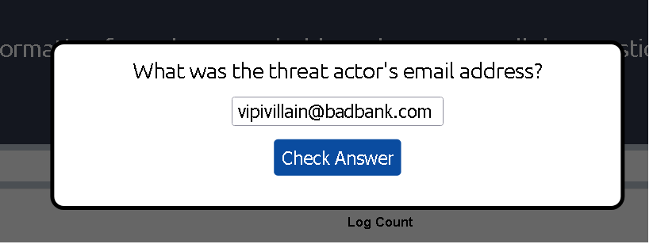

And the attacker downloaded an .exe file which is most likely the maleware that he downlaoded onto the system.

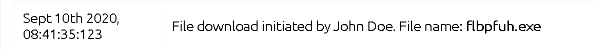

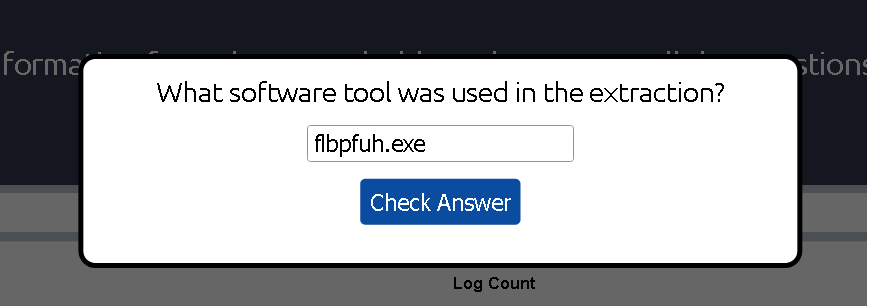

And we gain the flag of this exercise by completing all the tasks.

- What was the source email address?
> vipivillain@badbank.com

- What was the name of the file downloaded?
> flbpfuh.exe

- After building the threat profile, what message do you receive?
>  THM{NOW_I_CAN_CTI}
>