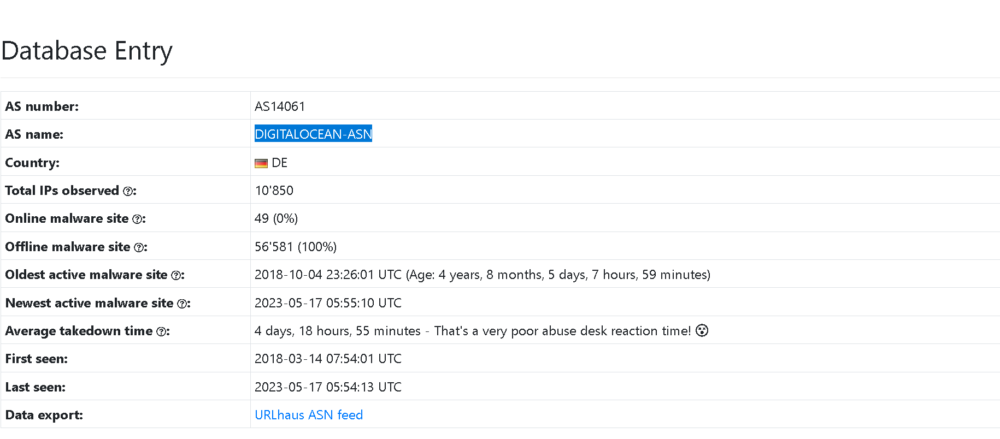

### Explore different OSINT tools used to conduct security threat assessments and investigations.

## Task 1 Room Outline

- Read the description! Continue to the next task.
> No answer needed

## Task 2 Threat Intelligence

Threat Intelligence is the analysis of data and information using tools and rechniques to generate patterns on how to  mitigate against potential risks associated  with existing or emerging threats targeting organisations, industries, sectors or governments.

- I've read on Threat Intel and the classifications
> No answer needed

## Task 3 UrlScan.io

Urlscan automates the process of browsing through websites to record activities and interactions.

- What is TryHackMe's Cisco Umbrella Rank?

> 345612

- How many domains did UrlScan.io identify?

> 13

- What is the main domain registrar listed?

> NAMECHEAP INC

- What is the main IP address identified?

> 2606:4700:10::ac43:1b0a

## Task 4 Abuse.ch

- The IOC **212.192.246.30:5555** is linked to which malware alias on ThreatFox?

> Katana

- Which malware is associated with the JA3 Fingerprint **51c64c77e60f3980eea90869b68c58a8** on SSL Blacklist?

> Dridex

- From the statistics page on URLHaus, what malware-hosting network has the ASN number **AS14061**?

> DIGITALOCEAN-ASN

- Which country is the botnet IP address **178.134.47.166** associated with according to FeodoTracker?

> Georgia

## 