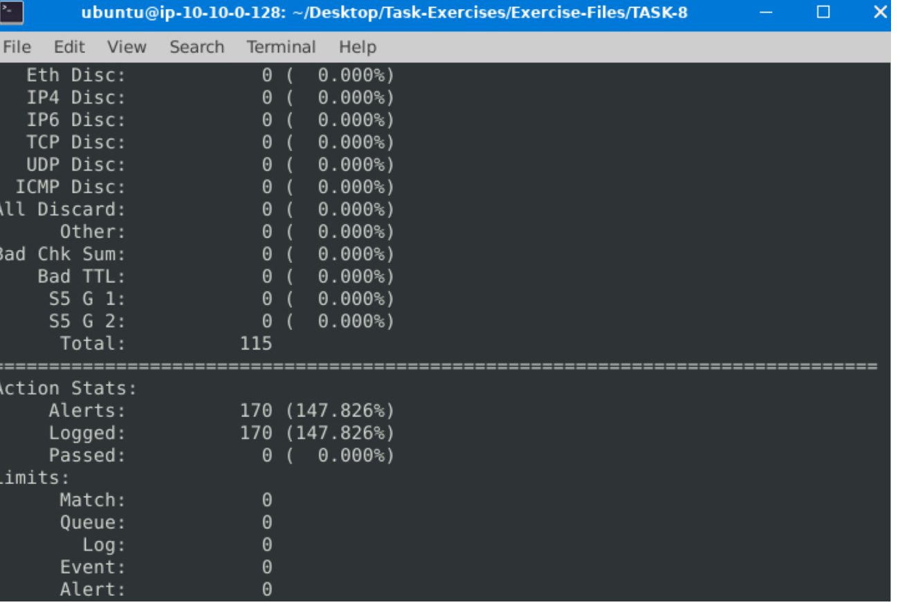
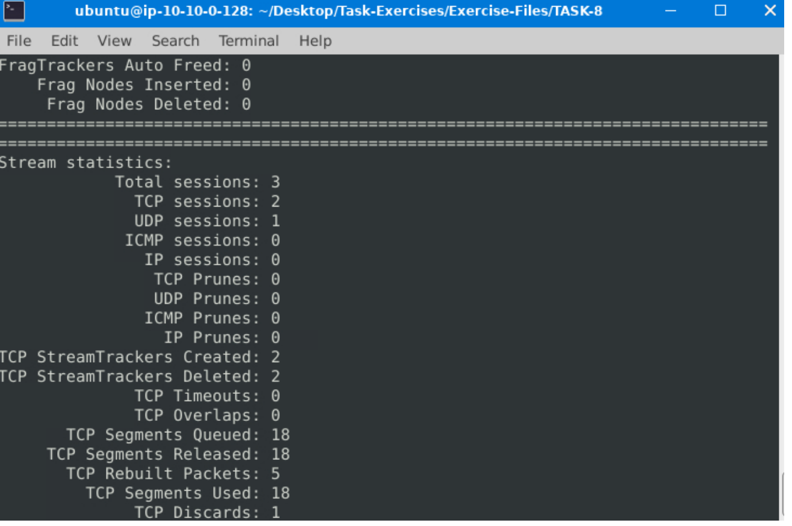
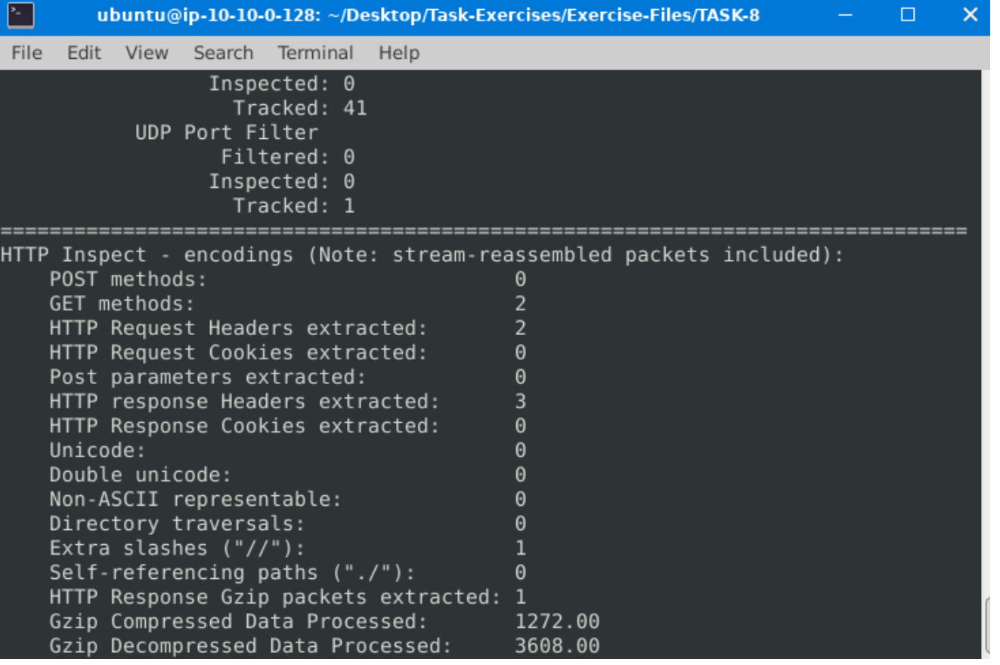
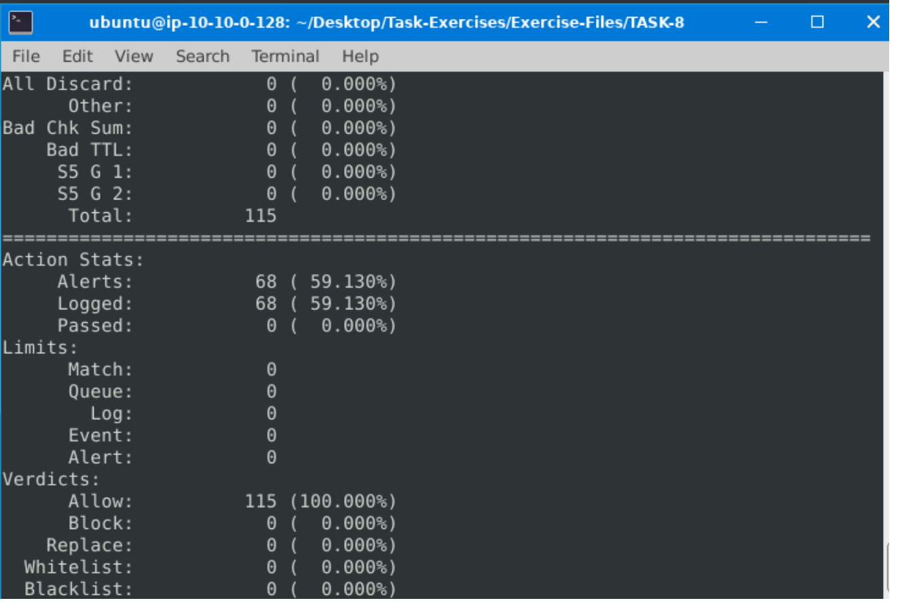
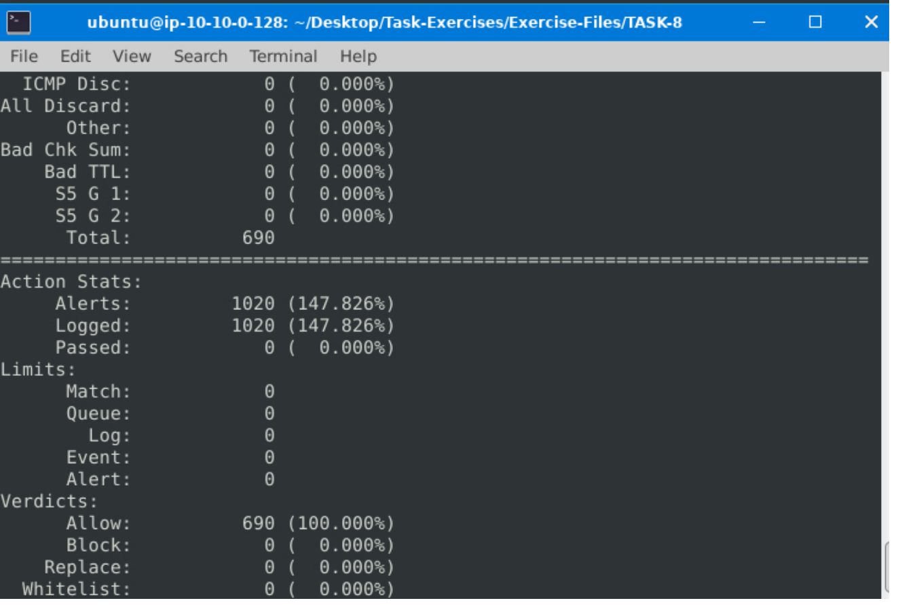

### Learn how to use Snort to detect real-time threats, analyse recorded traffic files and identify anomalies.

## Task 1 Introduction

- Read the task above.
> No answer needed

## Task 2 Interactive Material and VM

- Navigate to the Task-Exercises folder and run the command "./.easy.sh" and write the output

We navigate to the "Task-Exercises" folder and then execute the command "./.easy.sh" to gain the answer.

> Too Easy!

## Task 3 Introduction to IDS/IPS

**IDS** can identify threats but require user assistance to stop them.
**IPS** can identify and block the threats with less user assistance at the detection time.

- Which snort mode can help you stop the threats on a local machine?
> HIPS

- Which snort mode can help you detect threats on a local network?
> NIDS

- Which snort mode can help you detect the threats on a local machine?
> HIDS

- Which snort mode can help you stop the threats on a local network?
> NIPS

- Which snort mode works similar to NIPS mode?
> NBA

- According to the official description of the snort, what kind of NIPS is it?
> full-blown

- NBA training period is also known as ...
> baselining

## Task 4 First Interaction with Snort

- Run the Snort instance and check the build number.

Run the same command as shown in the example just with the -V flag.
> 149

- Test the current instance with "**/etc/snort/snort.conf**" file and check how many rules are loaded with the current build.
Run the "sudo snort -c /etc/snort/snort.conf -T" command.

> 4151

- Test the current instance with "**/etc/snort/snortv2.conf**" file and check how many rules are loaded with the current build.

> 1

## Task 5 Operation Mode 1: Sniffer Mode

- You can practice the parameter combinations by using the traffic-generator script.
> No answer needed

## Task 6 Operation Mode 2: Packet Logger Mode

- Now, you should have the logs in the current directory. Navigate to folder "145.254.160.237". What is the source port used to connect port 53?
> 3009

- Read the snort.log file with Snort; what is the IP ID of the 10th packet?
> 49313

- Read the "**snort.log.1640048004"** file with Snort; what is the referer of the 4th packet?
> http://www.ethereal.com/development.html

- Read the "**snort.log.1640048004"** file with Snort; what is the Ack number of the 8th packet?
> 0x38AFFFF3

- Read the "**snort.log.1640048004"** file with Snort; what is the number of the **"TCP port 80"** packets?
> 41

## Task 7 Operation Mode 3: IDS/IPS

 - What is the number of the detected HTTP GET methods?
> 2

- You can practice the rest of the parameters by using the traffic-generator script.
>  No answer needed

## Task 8 Operation Mode 4: PCAP Investigation

- What is the number of the generated alerts?

> 170

- Keep reading the output. How many TCP Segments are Queued?

> 18

- Keep reading the output.How many "HTTP response headers" were extracted?

> 3

- What is the number of the generated alerts?

> 68

- What is the number of the generated alerts?
> 340

- Keep reading the output. What is the number of the detected TCP packets?
> 82

- What is the number of the generated alerts?

> 1020

## Task 9 Snort Rule Structure

- Write a rule to filter **IP ID "35369"** and run it against the given pcap file. What is the request name of the detected packet? `snort -c local.rules -A full -l . -r task9.pcap`

With the help of the comment `sudo gedit /etc/snort/snort.conf` we can design our custom rules inside of snort.

> TIMESTAMP REQUEST

- Create a rule to filter packets with Syn flag and run it against the given pcap file. What is the number of detected packets?
> 1

- Write a rule to filter packets with Push-Ack flags and run it against the given pcap file. What is the number of detected packets?
> 216

- Create a rule to filter packets with the same source and destination IP and run it against the given pcap file. What is the number of detected packets?
> 10

- Case Example - An analyst modified an existing rule successfully. Which rule option must the analyst change after the implementation?
> rev

## Task 10 Snort2 Operation Logic: Points to Remember

- Read the task above.
> No answer needed

## Task 11 Conclusion

-  Read the task above.
> No answer needed

