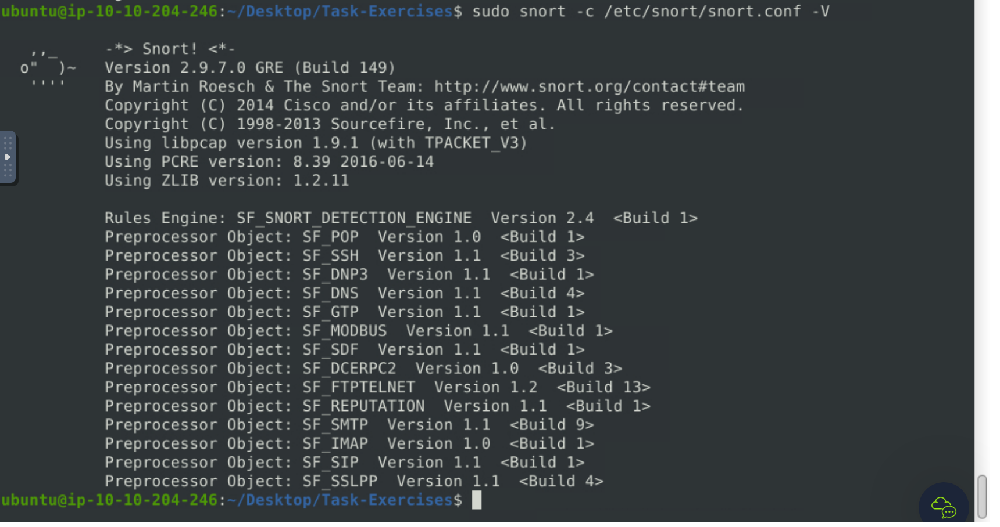
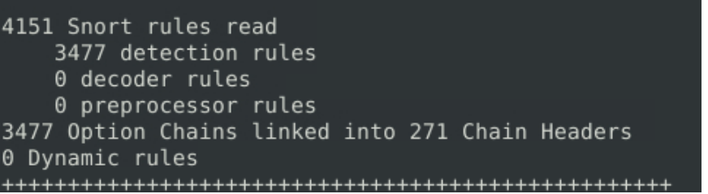
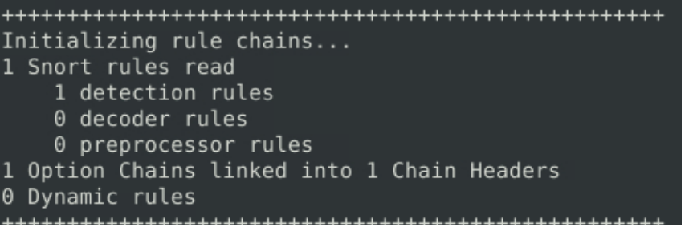

### Learn how to use Snort to detect real-time threats, analyse recorded traffic files and identify anomalies.

## Task 1 Introduction

- Read the task above.
> No answer needed

## Task 2 Interactive Material and VM

- Navigate to the Task-Exercises folder and run the command "./.easy.sh" and write the output

We navigate to the "Task-Exercises" folder and then execute the command "./.easy.sh" to gain the answer.

> Too Easy!

## Task 3 Introduction to IDS/IPS

**IDS** can identify threats but require user assistance to stop them.
**IPS** can identify and block the threats with less user assistance at the detection time.

- Which snort mode can help you stop the threats on a local machine?
> HIPS

- Which snort mode can help you detect threats on a local network?
> NIDS

- Which snort mode can help you detect the threats on a local machine?
> HIDS

- Which snort mode can help you stop the threats on a local network?
> NIPS

- Which snort mode works similar to NIPS mode?
> NBA

- According to the official description of the snort, what kind of NIPS is it?
> full-blown

- NBA training period is also known as ...
> baselining

## Task 4 First Interaction with Snort

- Run the Snort instance and check the build number.

Run the same command as shown in the example just with the -V flag.
> 149

- Test the current instance with "**/etc/snort/snort.conf**" file and check how many rules are loaded with the current build.
Run the "sudo snort -c /etc/snort/snort.conf -T" command.

> 4151

- Test the current instance with "**/etc/snort/snortv2.conf**" file and check how many rules are loaded with the current build.

> 1

## Task 5 Operation Mode 1: Sniffer Mode

- You can practice the parameter combinations by using the traffic-generator script.
> No answer needed

## Task 6 Operation Mode 2: Packet Logger Mode

- Now, you should have the logs in the current directory. Navigate to folder "145.254.160.237". What is the source port used to connect port 53?
> 3009

- Read the snort.log file with Snort; what is the IP ID of the 10th packet?
> 49313

- Read the "**snort.log.1640048004"** file with Snort; what is the referer of the 4th packet?
> http://www.ethereal.com/development.html

- Read the "**snort.log.1640048004"** file with Snort; what is the Ack number of the 8th packet?
> 0x38AFFFF3

- Read the "**snort.log.1640048004"** file with Snort; what is the number of the **"TCP port 80"** packets?
> 41

