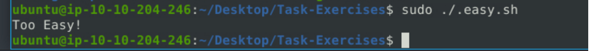

### Learn how to use Snort to detect real-time threats, analyse recorded traffic files and identify anomalies.

## Task 1 Introduction

- Read the task above.
> No answer needed

## Task 2 Interactive Material and VM

- Navigate to the Task-Exercises folder and run the command "./.easy.sh" and write the output

We navigate to the "Task-Exercises" folder and then execute the command "./.easy.sh" to gain the answer.

> Too Easy!

## Task 3 Introduction to IDS/IPS

