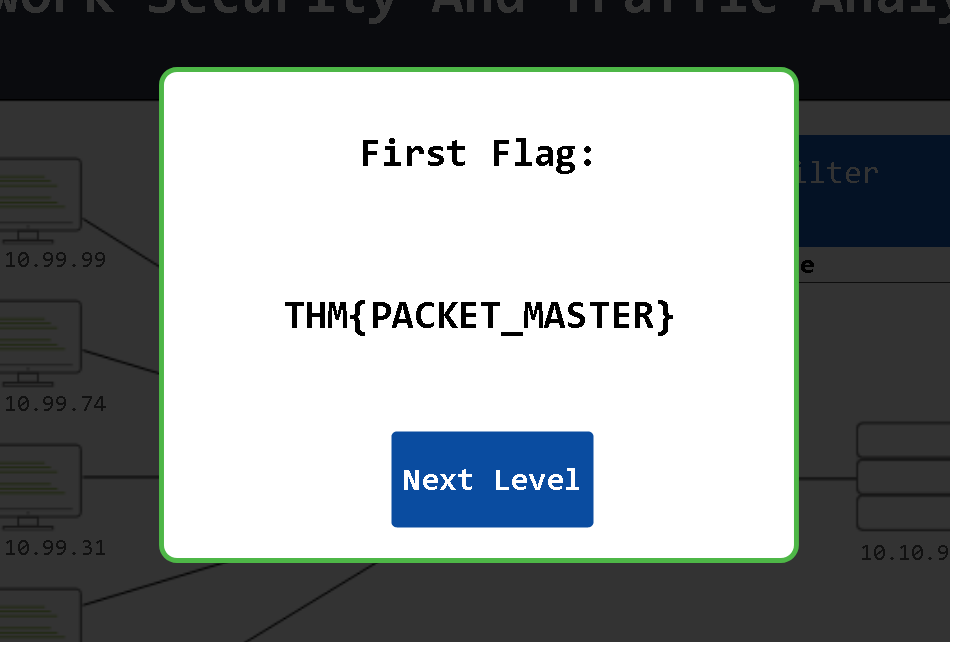
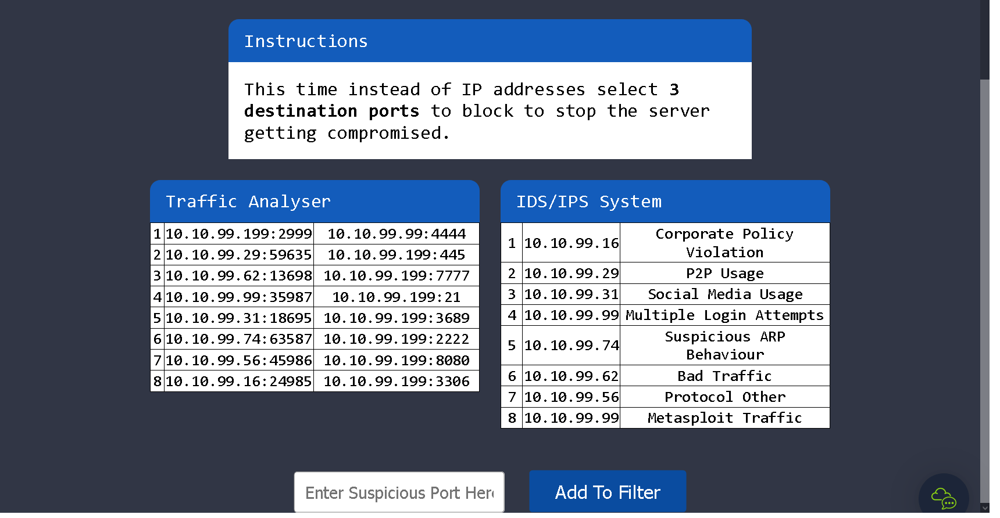
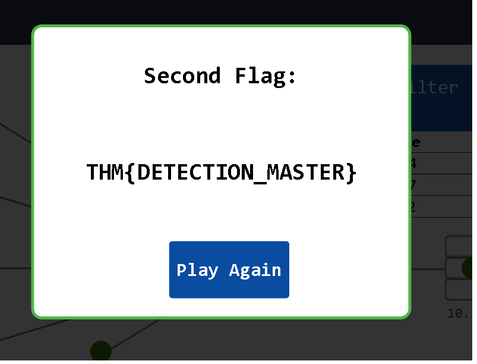

### Learn Network Security and Traffic Analysis foundations and take a step into probing network anomalies.

## Task 1 Introduction

- Read the task above.
> No answer needed

## Task 2 Network Security and Network Data

- Which Security Control Level covers contain creating security policies?
> Administrative

- Which Access Control element works with data metrics to manage data flow?
> Load Balancing

- Which technology helps correlate different tool outputs and data sources?
> SOAR

## Task 3 Traffic Analysis

**Level-1** is simulating the identification and filtering of malicious IP addresses.

- What is the flag?

Not only shows the IP address 10.10.99.99 multiple login attempts aswell as Metasploit Traffic which is a common hacking tool so we block this IP address with the filter.
There is also "Bad Traffic" which we want to catch with our filter aswell.

> THM{PACKET_MASTER}

Level-2 is simulating the identification and filtering of malicious IP and Port addresses.

- What is the flag?

> THM{DETECTION_MASTER}

## Task 4 Conclusion

- Read the task above.
> No answer needed

