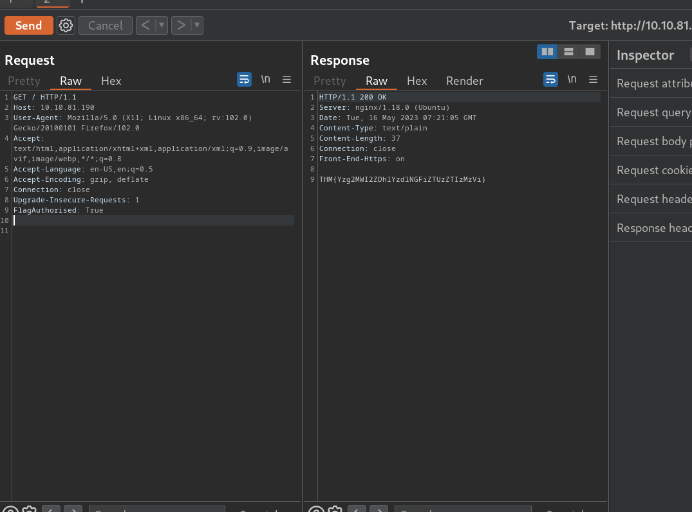

### Learn how to use Repeater to duplicate requests in Burp Suite

## Task 1 Introduction Outline

- _**Note:** If you are not using the AttackBox and want to connect to this machine without the VPN, you can do so using this link once the machine has fully loaded and an IP address is displayed:_ [https://LAB_WEB_URL.p.thmlabs.com](https://LAB_WEB_URL.p.thmlabs.com)_._
> No answer needed

## Task 2 Repeater What is Repeater?

- Familiarise yourself with the Repeater interface.
> No answer needed

## Task 3 Repeater Basic Usage

- Practice modifying and re-sending the request numerous times.
> No answer needed

## Task 4 Repeater Views

- Experiment with the available view options.
> No answer needed

- Which view option displays the response in the same format as your browser would?
> Render

## Task 5 Repeater Inspector

- Get comfortable with Inspector and practice adding/removing items from the various request sections.
> No answer needed

## Task 6 Practical Example

- Capture a request to `MACHINE IP` in the Proxy and send it to Repeater.
> No answer needed

- Try viewing this in one of the other view options (e.g. Rendered).
> No answer needed

- Send the request. What is the flag you receive?

We send the "FlagAuthorised: True" request to gain the flag.

> THM{Yzg2MWI2ZDhlYzdlNGFiZTUzZTIzMzVi}

## Task 7 Practical Challenge

