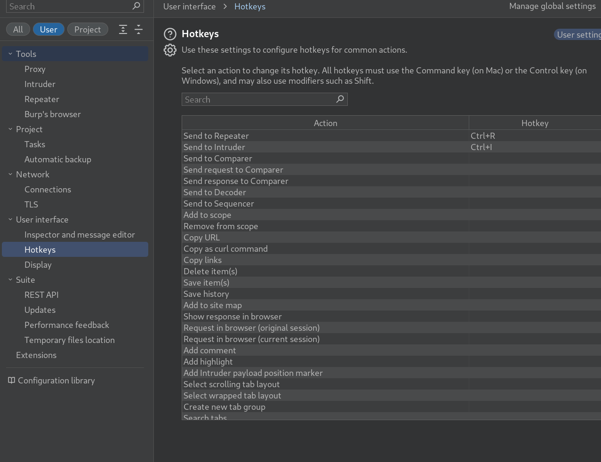
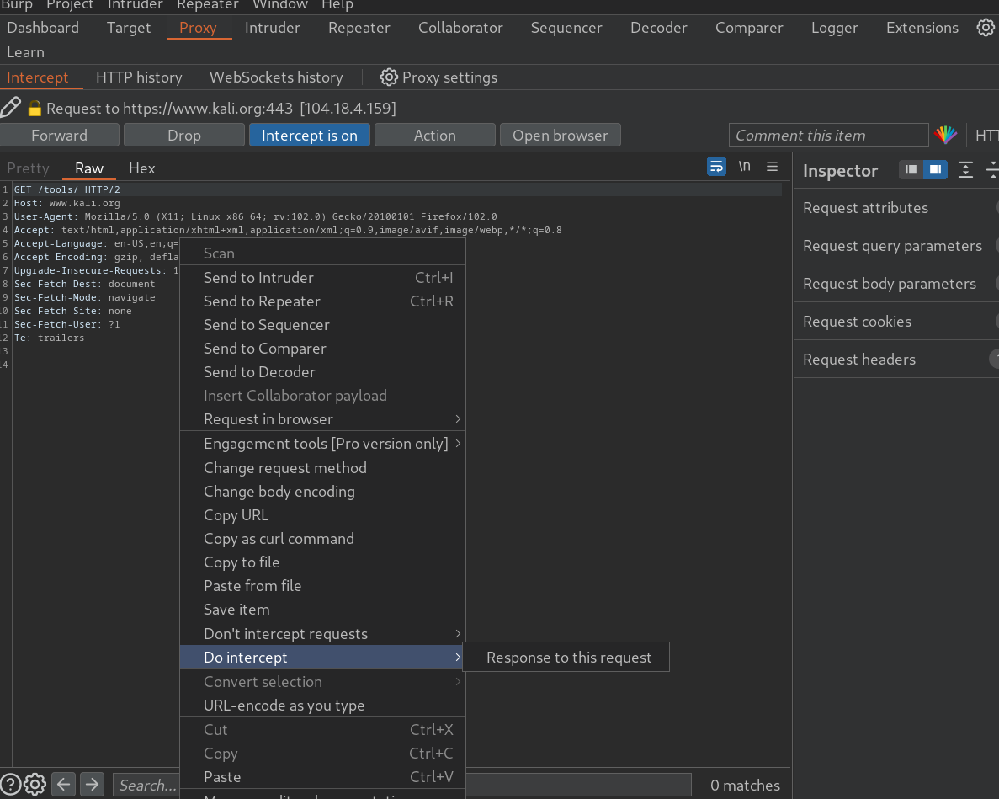

### An introduction to using Burp Suite for Web Application pentesting

## Task 1 Introduction Outline

- Deploy the machine attached to the task by pressing the green "Start Machine" button, as well as the AttackBox (using the "Start AttackBox" button at the top of the page) if you are not using your own machine.
> No answer needed

## Task 2 Getting Started What is Burp Suite?

- Which edition of Burp Suite will we be using in this module?
> Burp Suite Community

- Which edition of Burp Suite runs on a server and provides constant scanning for target web apps?
> Burp Suite Enterprise

- Burp Suite is frequently used when attacking web applications and ______ applications.
> Mobile

## Task 3 Getting Started Features of Burp Community

- Which Burp Suite feature allows us to intercept requests between ourselves and the target?
> Proxy

- Which Burp tool would we use if we wanted to bruteforce a login form?
> Intruder

## Task 4 Getting Started Installation

- If you have chosen not to use the AttackBox, make sure that you have a copy of Burp Suite installed before proceeding.
> No answer needed

## Task 5 Getting Started The Dashboard

- Open Burp Suite and have a look around the dashboard. Make sure that you are comfortable with it before moving on.
> No answer needed

## Task 6 Getting Started Navigation

- Get comfortable navigating around the top menu bars.
> No answer needed

## Task 7 Getting Started Options

- Change the Burp Suite theme to dark mode
> No answer needed

- In which _Project options_ sub-tab can you find reference to a "Cookie jar"?

> Sessions

- In which _User options_ sub-tab can you change the Burp Suite update behaviour?
> Misc

- What is the name of the section within the _User options_ "Misc" sub-tab which allows you to change the Burp Suite keybindings?

> hotkeys

- If we have uploaded Client-Side TLS certificates in the _User options_ tab, can we override these on a per-project basis (Aye/Nay)?
> Aye

- In the next section, we will cover the Burp Proxy -- a much more hands-on aspect of the room.
> No answer needed

## Task 8 Proxy Introduction to the Burp Proxy

- Which button would we choose to send an intercepted request to the target in Burp Proxy?
> Forward

- **[Research]** What is the default keybind for this? _**Note:** Assume you are using Windows or Linux (i.e. swap Cmd for Ctrl)._
> CTRL+F

## Task 9 Proxy Connecting through the Proxy (FoxyProxy)

- There is one particularly useful option that allows you to intercept and modify the _response_ to your request. What is this option?

> Response to this request

- **[Bonus Question -- Optional]** Try installing FoxyProxy standard and have a look at the pattern matching features.
> No answer needed

## Task 10 Proxy Proxying HTTPS

- If you are not using the AttackBox, configure Firefox (or your browser of choice) to accept the Portswigger CA certificate for TLS communication through the Burp Proxy.
> No answer needed

## Task 11 Proxy The Burp Suite Browser

- Using the in-built browser, make a request to MACHINE IP and capture it in the proxy.
> No answer needed

## Task 12 Proxy Scoping and Targeting

- Add MACHINE IP to your scope and change the Proxy settings to only intercept traffic to in-scope targets. See the difference between the amount of traffic getting caught by the proxy before and after limiting the scope.
> No answer needed

## Task 13 Proxy Site Map and Issue Definitions

- What is the flag you receive?
> THM{NmNlZTliNGE1MWU1ZTQzMzgzNmFiNWVk}

- What is the typical severity of a Vulnerable JavaScript dependency?
> low

## Task 14 Practical Example Attack

- You should find that you get an alert box from the site indicating a successful XSS attack!
> No answer needed

- Don't expect it to be quite so easy in real life, but this should hopefully give you an idea of the kind of situation in which Burp Proxy can be useful.
> No answer needed

## Task 15 Conclusion Room Conclusion

- I understand the fundamentals of using Burp Suite!
> No answer needed

