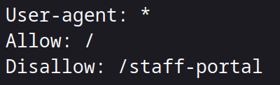

### Learn the various ways of discovering hidden or private content on a webserver that could lead to new vulnerabilities.

## Task 1 What Is Content Discovery?

- What is the Content Discovery method that begins with M?
> Manually

- What is the Content Discovery method that begins with A?
> Automated

- What is the Content Discovery method that begins with O?
> OSINT

## Task 2 Manual Discovery - Robots.txt

- What is the directory in the robots.txt that isn't allowed to be viewed by web crawlers?

First we go to the specified webpage which is /staff-portal.

> /staff-portal

## Task 3 Manual Discovery - Favicon

We input the above mentioned command to get a hash.

With that hash we can search the OWASP_favicon_database

> 
