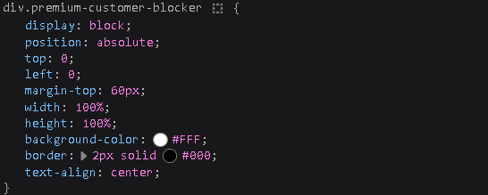
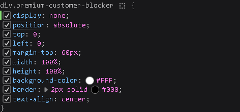

## Task 1 Walking An Application

- I confirm that I have deployed the virtual machine and opened the website.
> No answer needed

## Task 2 Exploring The Website

- Read the above.
> No answer needed

## Task 3 Viewing The Page Source

- What is the flag from the HTML comment?

The HTML code starts with this comment that contains the location of the first flag.

Type now "view-source:https://10-10-171-58.p.thmlabs.com/new-home-beta" to get the first flag.

> THM{HTML_COMMENTS_ARE_DANGEROUS}

- What is the flag from the secret link?

We see that there is a "secret-page" located in the HTML code.

Inside the sides HTML is the flag

> THM{NOT_A_SECRET_ANYMORE}

- What is the directory listing flag?

First we need to go to the /assets page to see all the directories

Then we go on the "flag.txt" file to gain the flag

- What is the framework flag?

Check the comment at the end of the code for a website which we can access to gain the framework flag.

On the website we can go on the "Change Log" and see that there is a file which we can access on /tmp.zip

Enter /tmp.zip in the search bar to download a zip file. This zip file contains a txt file with the last flag in it.

> THM{KEEP_YOUR_SOFTWARE_UPDATED}

## Task 4 Developer Tools - Inspector

- What is the flag behind the paywall?

The website we try to access is blocked behind a paywall.

So first we try to find the div block that is handling this blocker. Which is named "premium-customer-blocker".

Under the HTML code is the CSS code. Where it says "display: block". We take away the "block" and replace it now with "none".

The end result is that the block from the website is now gone and we got the flag.

> THM{NOT_SO_HIDDEN}

## Task 5 Developer Tools - Debugger

In Google Chrome the Debugger is called Sources.
In Firefox and Safari its called Debugger.

- What is the flag in the red box?

We can use Pretty Print on the file "flash.min.js" to then set a breakpoint in the code which then reveals the flag to us.

The program stopped executing to show us the flag.

> THM{CATCH_ME_IF_YOU_CAN}

## Task 6 Developer Tools - Network

- What is the flag shown on the contact-msg network request?

We just make a new contact form and send a new message to reveal the final flag inn the Response form.

> THM{GOT_AJAX_FLAG}