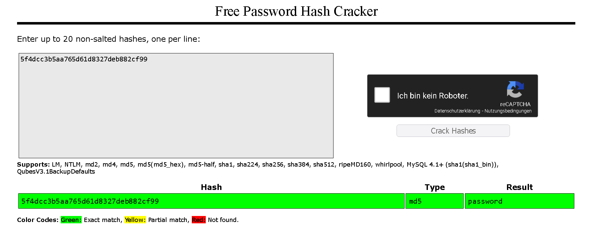

### Learn about and exploit each of the OWASP Top 10 vulnerabilities; the 10 most critical web security risks.

## Task 1 Introduction

- Read the above.
> No answer needed

## Task 2 Accessing Machines

- Connect to our network or deploy the AttackBox.
> No answer needed

## Task 3 1. Broken Access Control

There are websites that should not be accessible for regular users.
If a regular user uses one of those sites it can lead to:
-   Being able to view sensitive information from other users
-   Accessing unauthorized functionality

It allows attackers to bypass authorisation.

- Read and understand what broken access control is.
> No answer needed

## Task 4 Broken Access Control (IDOR Challenge)

IDOR (Insecure Direct Object Reference) refers to an access control vulnerability where you can access resources you wouldnt be able to see normally. 

Lets say we have `https://bank.thm/account?id=111111` which we can use to access our account.

Nothing wrong here but if we change the id to another number and are able to see another users account then this is a vulnerability we just have found.

- Read and understand how IDOR works.
> No answer needed

- Deploy the machine and go to MACHINE IP - Login with the username noot and the password test1234.
> No answer needed

- Look at other users' notes. What is the flag?

Login with the user credentials given and then change the value of the "id" parameter to 0 to gain the flag.

> flag{fivefourthree}

## Task 5 2. Cryptographic Failures

A cryptographic failure is a vulnerability that came from the misuse of cryptographic algorithms for protecting sensitive information.

- Read the introduction to Cryptographic Failures and deploy the machine.
> No answer needed

## Task 6 Cryptographic Failures (Supporting Material 1)

- Read and understand the supporting material on SQLite Databases.
> No answer needed

## Task 7 Cryptographic Failures (Supporting Material 2)

With Crackstation we can crack weak hashes in our browser like this:

- Read the supporting material about cracking hashes.
>  No answer needed

## Task 8 Cryptographic Failures (Challenge)

- What is the name of the mentioned directory?
> /assets

- Navigate to the directory you found in question one. What file stands out as being likely to contain sensitive data?
> webapp.db

- Use the supporting material to access the sensitive data. What is the password hash of the admin user?
> 6eea9b7ef19179a06954edd0f6c05ceb

- What is the admin's plaintext password?
> qwertyuiop

- Log in as the admin. What is the flag?
> THM{Yzc2YjdkMjE5N2VjMzNhOTE3NjdiMjdl}

## Task 9 3. Injection

Injections are when applications interpret user-controlled input as commands or parameters.

- I've understood Injection attacks.
> No answer needed

## 