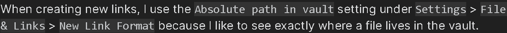

# Step 1

sdoijfosijdfojisdfiosfijo fisodiofjdsijo 
fdsjifdsojifjidjfoisd

1. this is one
2. then 2

# Step 2

![[new.png]]

ifsdjoijfsdiojfds

![[fsdf.png]]

- iojsfgdijfsd
- fjsdiifsd

b
![[letthiswork.png]]

